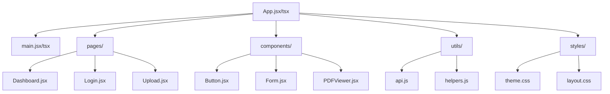

# Frontend Overview

This section documents the frontend of the ReViewPoint project.

## Structure

- **Directory-level breakdown**: Each major directory is described, with its purpose and relationships.
- **File-level details**: Each file will have its own documentation page, covering purpose, API, methods, and test mappings.

## Component Hierarchy Diagram

## Navigation

- Use the sidebar or links below to explore the frontend documentation.
- All files and directories will be cross-referenced for easy navigation.

## Status

_The frontend codebase is not yet implemented. This documentation structure is prepared for future use._

---

## Directory Structure (Template)

- `src/` — Main source code for the frontend
  - `components/` — Reusable UI components
  - `pages/` — Page-level components/routes
  - `styles/` — CSS/SCSS files
  - `utils/` — Utility functions
- `tests/` — Frontend tests

---

## How to Document

- For each new file, create a corresponding `.md` file in the appropriate docs directory.
- Use the provided templates for consistency.
- Cross-reference related files and tests.
