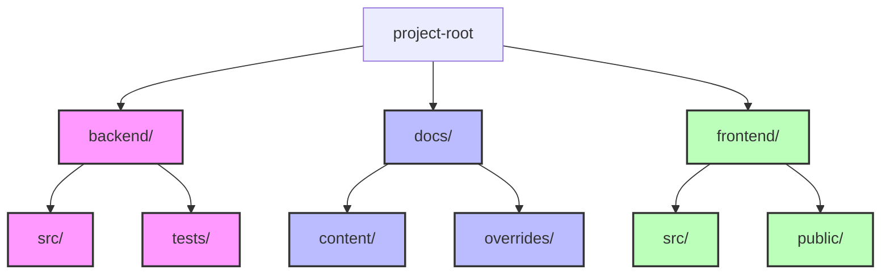
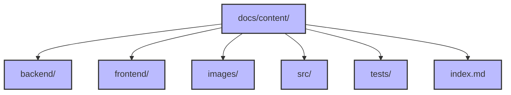
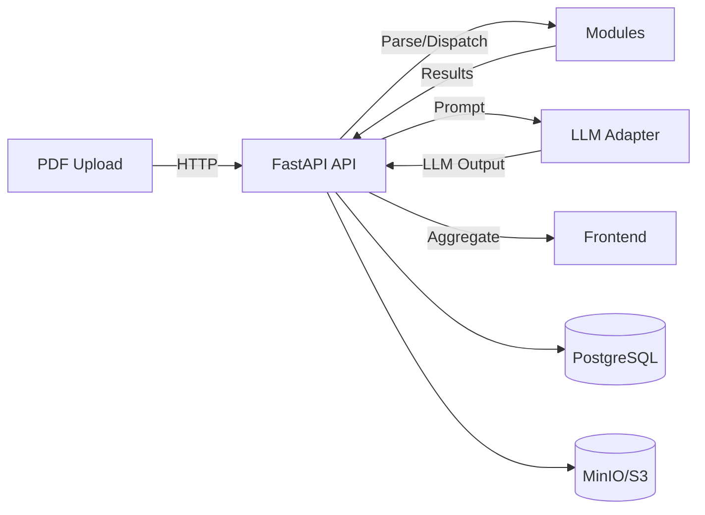
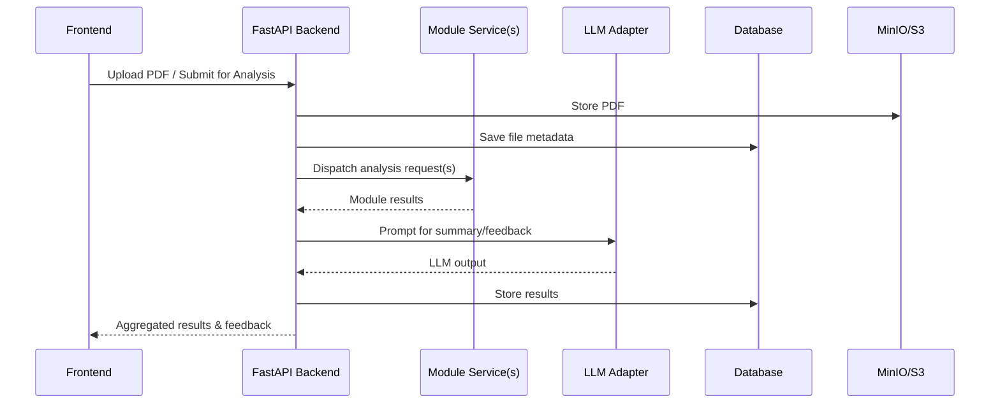

# ReViewPoint System Architecture

Welcome to the technical architecture overview for ReViewPoint—a modular, scalable, and LLM-powered platform for scientific paper review. This document provides a visual and narrative guide to the system’s structure, data flow, and extensibility.

---

## High-Level System Structure



---

## Directory Structure & Legends

### Backend Details (src/)

<!-- prettier-ignore-start -->
<!-- markdownlint-disable MD046 -->
??? info "backend/src/"

    | File/Folder | Description |
    |-------------|-------------|
    | [alembic_migrations/](#alembic_migrations) | Database migration scripts and Alembic configuration for schema evolution. |
    | [api/](#api) | API endpoints and dependencies, including versioned routes and dependency injection. |
    | [core/](#core) | Core configuration, database setup, logging, security, and event hooks. |
    | [middlewares/](#middlewares) | Custom FastAPI middleware for request/response processing and logging. |
    | [models/](#models) | SQLAlchemy ORM models for users, files, and related entities. |
    | [repositories/](#repositories) | Data access layer (CRUD) for users, files, and other models. |
    | [schemas/](#schemas) | Pydantic schemas for API request/response validation. |
    | [services/](#services) | Business logic and service layer for users, uploads, etc. |
    | [utils/](#utils) | Utility modules for hashing, validation, caching, and more. |
    | [CONTRIBUTING.md](backend/src/alembic_migrations/CONTRIBUTING.md.md) | Placeholder description |
    | [README.md](backend/src/alembic_migrations/README.md.md) | Placeholder description |
    | [\_\_about\_\_.py](backend/src/__about__.py.md) | Project version and metadata. |
    | [\_\_init\_\_.py](backend/src/__init__.py.md) | Marks the directory as a Python package. |
    | [main.py](backend/backend/src/main.py.md) | FastAPI application entry point and app factory. |

??? info "alembic_migrations/"

    | File | Description |
    |------|-------------|
    | [versions/](backend/src/alembic_migrations/versions/initial_migration.md) | Individual migration scripts for schema evolution. |
    | [README](backend/src/alembic_migrations/README.md) | Placeholder description |
    | [\_\_init\_\_.py](backend/src/alembic_migrations/__init__.py.md) | Marks the directory as a Python package. |
    | [alembic.ini](backend/src/alembic_migrations/alembid.ini.md) | Placeholder description |
    | [env.py](backend/src/alembic_migrations/env.py.md) | Configures Alembic for database schema migrations. |
    | [script.py.mako](backend/src/alembic_migrations/script.py.mako.md) | Placeholder description |

??? info "alembic_migrations/versions/"

    | File | Description |
    |------|-------------|
    | [20250605_add_used_password_reset_tokens.py](src/alembic_migrations/versions/20250605_add_used_password_reset_tokens.md) | Adds table for single-use password reset tokens. |
    | [9fc3acc47815_initial_migration_users_and_files_tables.py](src/alembic_migrations/versions/9fc3acc47815_initial_migration_users_and_files_tables.md) | Initial migration: users & files tables. |

??? info "api/"

    | File | Description |
    |------|-------------|
    | [v1/](#api-v1) | Placeholder description. |
    | [\_\_init\_\_.py](backend/src/api/__init__.py.md) | Marks the directory as a Python package. |
    | [deps.py](backend/src/api/deps.py.md) | Placeholder description. |

??? info "api/v1/"

    | File | Description |
    |------|-------------|
    | [\_\_init\_\_.py](backend/src/api/v1/__init__.py.md) | Marks the directory as a Python package. |
    | [auth.py](backend/src/api/v1/auth.py.md) | Placeholder description. |
    | [uploads.py](backend/src/api/v1/uploads.py.md) | Placeholder description. |
    | [users.py](backend/src/api/v1/users.py.md) | Placeholder description. |

??? info "core/"

    | File | Description |
    |------|-------------|
    | [\_\_init\_\_.py](backend/src/core/__init__.py.md) | Marks the directory as a Python package. |
    | [config.py](backend/src/core/config.py.md) | Placeholder description. |
    | [database.py](backend/src/core/database.py.md) | Placeholder description. |
    | [events.py](backend/src/core/events.md) | Placeholder description. |
    | [logging.py](backend/src/core/logging.py.md) | Placeholder description. |
    | [security.py](backend/src/core/security.py.md) | Placeholder description. |

??? info "middlewares/"

    | File | Description |
    |------|-------------|
    | [\_\_init\_\_.py](backend/src/middlewares/__init__.py.md) | Marks the directory as a Python package. |
    | [logging.py](backend/src/middlewares/logging.py.md) | Placeholder description. |

??? info "models/"

    | File | Description |
    |------|-------------|
    | [\_\_init\_\_.py](backend/src/models/__init__.py.md) | Marks the directory as a Python package. |
    | [base.py](backend/src/models/base.py.md) | Placeholder description. |
    | [file.py](backend/src/models/file.py.md) | Placeholder description. |
    | [used_password_reset_token.py](backend/src/models/used_password_reset_token.py.md) | Placeholder description. |
    | [user.py](backend/src/models/user.py.md) | Placeholder description. |

??? info "repositories/"

    | File | Description |
    |------|-------------|
    | [\_\_init\_\_.py](backend/src/repositories/__init__.py.md) | Marks the directory as a Python package. |
    | [file.py](backend/src/repositories/file.py.md) | Placeholder description. |
    | [user.py](backend/src/repositories/user.py.md) | Placeholder description. |

??? info "schemas/"

    | File | Description |
    |------|-------------|
    | [\_\_init\_\_.py](backend/src/schemas/__init__.py.md) | Marks the directory as a Python package. |
    | [auth.py](backend/src/schemas/auth.py.md) | Placeholder description. |
    | [file.py](backend/src/schemas/file.py.md) | Placeholder description. |
    | [token.py](backend/src/schemas/token.py.md) | Placeholder description. |
    | [user.py](backend/src/schemas/user.py.md) | Placeholder description. |

??? info "services/"

    | File | Description |
    |------|-------------|
    | [\_\_init\_\_.py](backend/src/services/__init__.py.md) | Marks the directory as a Python package. |
    | [upload.py](backend/src/services/upload.py.md) | Placeholder description. |
    | [user.py](backend/src/services/user.py.md) | Placeholder description. |

??? info "utils/"

    | File | Description |
    |------|-------------|
    | [\_\_init\_\_.py](backend/src/utils/__init__.py.md) | Marks the directory as a Python package. |
    | [cache.py](backend/src/utils/cache.py.md) | Placeholder description. |
    | [errors.py](backend/src/utils/errors.py.md) | Placeholder description. |
    | [file.py](backend/src/utils/file.py.md) | Placeholder description. |
    | [hashing.py](backend/src/utils/hashing.py.md) | Placeholder description. |
    | [rate_limit.py](backend/src/utils/rate_limit.py.md) | Placeholder description. |
    | [validation.py](backend/src/utils/validation.py.md) | Placeholder description. |
<!-- markdownlint-enable MD046 -->
<!-- prettier-ignore-end -->

---

### Docs Structure



#### Docs Legend

| Node         | Purpose |
|--------------|---------|
| `content/`   | Markdown docs, images, API docs |
| `backend/`   | Backend documentation |
| `frontend/`  | Frontend documentation |
| `images/`    | Documentation images |
| `src/`       | Docs source code (if any) |
| `tests/`     | Docs test files (if any) |
| `index.md`   | Docs homepage |

---

### Frontend Structure


#### Frontend Legend

| Node         | Purpose |
|--------------|---------|
| `src/`       | Frontend source code |
| `public/`    | Frontend static/public files |

---

## Component Interactions & Data Flow

### Data Flow Diagram



### Sequence: Module Dispatch & LLM Interaction



### Data Flow Summary

| Step | Description                                      |
| ---- | ------------------------------------------------ |
| 1    | User uploads PDF via Frontend                    |
| 2    | Backend parses and stores file                   |
| 3    | Backend dispatches modules for analysis          |
| 4    | Modules return results to backend                |
| 5    | Backend aggregates results, may call LLM adapter |
| 6    | Aggregated results sent to Frontend for display  |

---

## Backend Details

- **Core**: `config.py`, `database.py`, `logging.py`, `security.py`, `events.py`
- **API**: `deps.py`, `v1/` (auth, uploads, users)
- **Models**: `base.py`, `user.py`, `file.py`, `used_password_reset_token.py`
- **Repositories**: `user.py`, `file.py`
- **Services**: `user.py`, `upload.py`
- **Middlewares**: `logging.py`
- **Utils**: `hashing.py`, `file.py`, `cache.py`, `errors.py`, `rate_limit.py`, `validation.py`
- **Migrations**: `alembic_migrations/`
- **Entry Point**: `main.py`

---

## Frontend Details

- **Stack**: React, Vite, TailwindCSS
- **Responsibilities**:
  - User authentication and session management
  - PDF upload and preview
  - Display of module results and LLM summaries
  - Interaction with backend via REST API
  - Responsive UI and error handling

---

## Docs Details

- **Docs**: MkDocs for live documentation
- **Content**: Markdown, API docs, images
- **Overrides**: Custom theme, 404 page, etc.

---

## Scalability & Extensibility Features

- **Modular Microservices**: Each analysis module is a Dockerized REST service, independently deployable and testable.
- **Parallel Evaluation**: Backend can dispatch multiple modules in parallel for faster analysis.
- **Plug-and-Play LLM Providers**: Easily switch between OpenAI, vLLM, or future providers.
- **Decoupled CI/CD**: Modules and core backend have separate CI pipelines for independent development.
- **Observability**: Optional Prometheus/Grafana integration for monitoring and metrics.
- **Extensible API**: Versioned API structure allows safe evolution of endpoints.

---

## Standard Module Output Example

```json
{
  "module_name": "structure_validator",
  "score": 78,
  "status": "warning",
  "feedback": ["Missing conclusion section.", "Introduction too short."],
  "version": "1.0.0"
}
```

---

For more details on each segment, see the [Backend Source Guide](backend-source-guide.md), [Module Guide](module-guide.md), and [Frontend Overview](frontend/overview.md)
