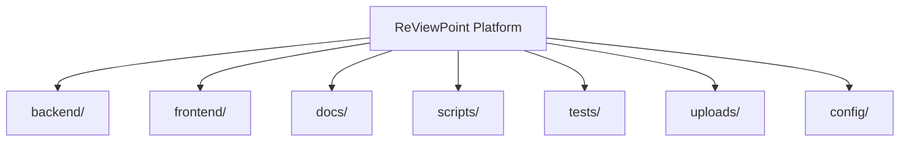
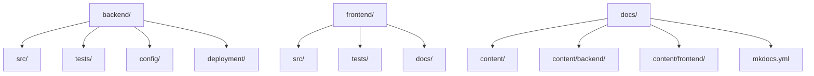
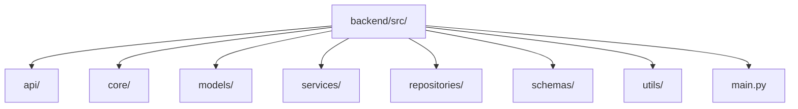
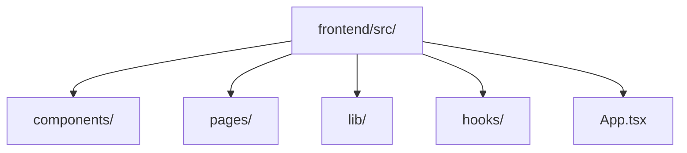
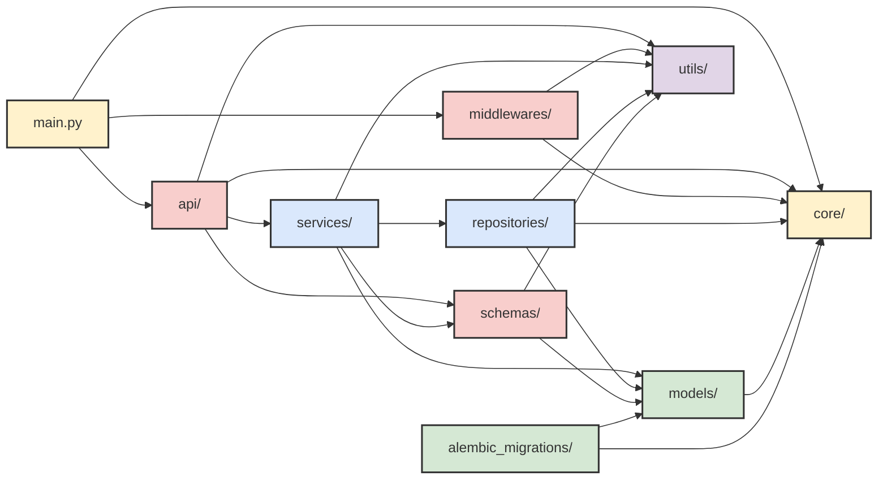
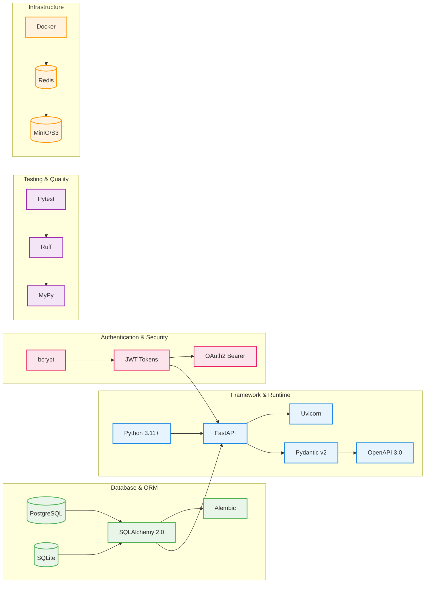
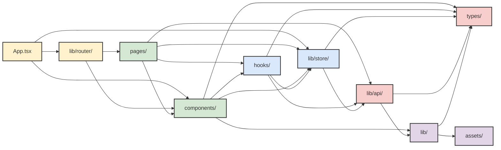
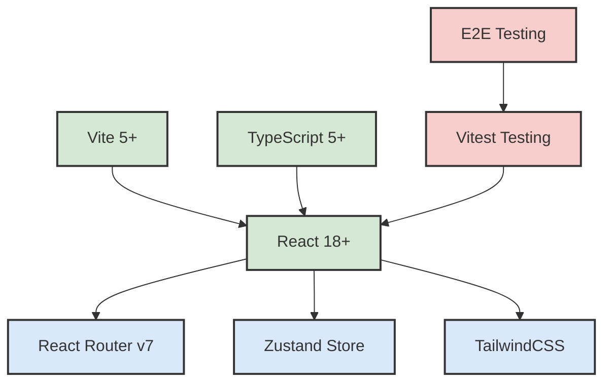
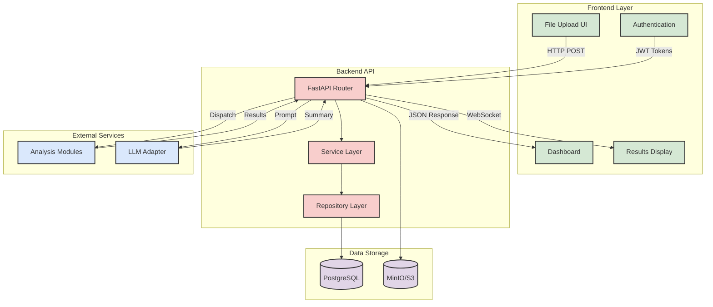
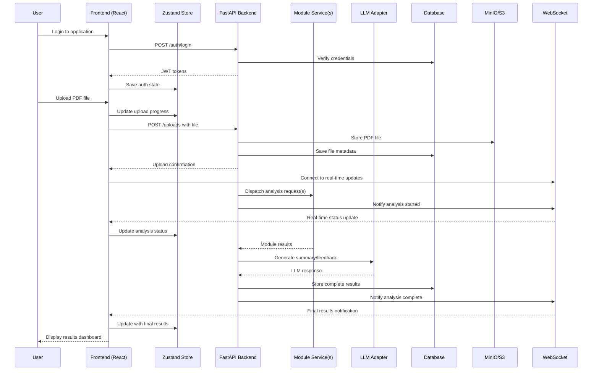

# ReViewPoint System Architecture

Welcome to the technical architecture overview for ReViewPoint—a modular, scalable, and LLM-powered platform for scientific paper review. This document provides a comprehensive visual and narrative guide to the system's structure, data flow, and extensibility.

## Overview

ReViewPoint is built as a modern full-stack application with:

- **Backend**: FastAPI with Python 3.11+, PostgreSQL, and async operations
- **Frontend**: React 18+ with TypeScript, Vite, and modern tooling
- **Architecture**: Layered design with clear separation of concerns
- **Scalability**: Microservices-ready with Docker containerization
- **Testing**: Comprehensive test coverage (135+ backend tests, 672+ frontend tests)
- **Documentation**: Complete coverage of all source files and components

## Document Structure

This architecture document is organized into the following sections:

1. **[Project Structure](#project-file-structure-visualization)** - High-level project organization
2. **[Directory Legend](#directory-structure-legend)** - Component purposes and technologies  
3. **[Detailed Structure](#detailed-structure-overview)** - File-by-file breakdown with documentation links
4. **[Architecture Patterns](#key-architecture-patterns)** - Core design principles
5. **[Backend Structure](#backend-structure)** - Backend architecture and communication patterns
6. **[Frontend Structure](#frontend-structure)** - Frontend architecture and component organization  
7. **[Data Flow](#data-flow)** - System-wide data flow patterns
8. **[Scalability](#system-scalability--extensibility)** - System scalability and extensibility features
9. **[Documentation Index](#complete-documentation-index)** - Links to all documentation files

**Note**: Frontend components in this document represent both current implementation and planned features. The frontend is not yet fully implemented in this branch.

## Project File Structure Visualization



**Expanded Structure:**



**Backend Source Structure:**



**Frontend Source Structure:**



## Directory Structure Legend

| Component | Purpose | Technology Stack |
|-----------|---------|------------------|
| **Backend** | REST API, business logic, data persistence | FastAPI, SQLAlchemy, PostgreSQL, Alembic |
| **Frontend** | User interface, client-side logic | React, TypeScript, Tailwind CSS, Vite |
| **Docs** | Project documentation and API reference | MkDocs, Markdown, Python-Markdown |
| **Scripts** | Development automation and deployment | Node.js, Python, Shell scripts |
| **Tests** | Cross-project integration testing | Pytest, Playwright, Vitest |
| **Config** | Project-wide configuration and tooling | JSON, YAML, TOML configuration files |

## Detailed Structure Overview

<!-- prettier-ignore-start -->
<!-- markdownlint-disable MD046 -->
??? info "backend/config/"

    | File | Description |
    |------|-------------|
    | [.env.template](backend/config/.env.template.md) | Environment configuration template with all required and optional settings. |

??? info "backend/src/"

    | File/Folder | Description |
    |-------------|-------------|
    | alembic_migrations/ | Database migration scripts and Alembic configuration for schema evolution. |
    | api/ | API endpoints and dependencies, including versioned routes and dependency injection. |
    | core/ | Core configuration, database setup, logging, security, and event hooks. |
    | middlewares/ | Custom FastAPI middleware for request/response processing and logging. |
    | models/ | SQLAlchemy ORM models for users, files, and related entities. |
    | repositories/ | Data access layer (CRUD) for users, files, and other models. |
    | schemas/ | Pydantic schemas for API request/response validation. |
    | services/ | Business logic and service layer for users, uploads, etc. |
    | static/ | Static files and assets served by the backend. |
    | utils/ | Utility modules for hashing, validation, caching, and more. |
    | [CONTRIBUTING.md](../backend/src/CONTRIBUTING.md) | Guidelines for contributing to backend development. |
    | [__about__.py](backend/src/__about__.py.md) | Project version and metadata. |
    | [__init__.py](backend/src/__init__.py.md) | Marks the directory as a Python package. |
    | [main.py](backend/src/main.py.md) | FastAPI application entry point and app factory. |

??? info "backend/src/alembic_migrations"
    
    | File/Folder | Description |
    |------|-------------|
    | versions/ | Individual migration scripts for schema evolution. |
    | [README](backend/src/alembic_migrations/README.md) | Generic single-database configuration documentation for Alembic |
    | [__init__.py](backend/src/alembic_migrations/__init__.py.md) | Marks the directory as a Python package. |
    | [env.py](backend/src/alembic_migrations/env.py.md) | Configures Alembic for database schema migrations. |
    | [script.py.mako](backend/src/alembic_migrations/script.py.mako.md) | Mako template for generating new database migration scripts |

??? info "backend/src/alembic_migrations/versions/"

    | File | Description |
    |------|-------------|
    | [f140e6f46727_initial_migration.py](backend/src/alembic_migrations/versions/f140e6f46727_initial_migration.md) | Initial database schema migration. |
    | [20250605_add_used_password_reset_tokens.py](backend/src/alembic_migrations/versions/20250605_add_used_password_reset_tokens.md) | Adds table for single-use password reset tokens. |
    | [31eb30e5f037_add_file_size_field.py](backend/src/alembic_migrations/versions/31eb30e5f037_add_file_size_field.md) | Adds file size field to the file model. |

??? info "backend/src/api/"

    | File/Folder | Description |
    |------|-------------|
    | v1/ | Version 1 API endpoints including authentication, users, file uploads, health checks, and WebSocket connections. |
    | [__init__.py](backend/src/api/__init__.py.md) | Marks the directory as a Python package. |
    | [deps.py](backend/src/api/deps.py.md) | FastAPI dependency injection utilities for authentication, database sessions, pagination, and request ID tracking. |

??? info "backend/src/api/v1/"

    | File/Folder | Description |
    |------|-------------|
    | users/ | User management endpoints organized as a submodule with core operations and data exports. |
    | [__init__.py](backend/src/api/v1/__init__.py.md) | Marks the directory as a Python package. |
    | [auth.py](backend/src/api/v1/auth.py.md) | Authentication endpoints for user registration, login, logout, password reset, and JWT token management. |
    | [health.py](backend/src/api/v1/health.py.md) | Health check endpoints for monitoring application and database status. |
    | [uploads.py](backend/src/api/v1/uploads.py.md) | File upload and management endpoints with authentication and validation. |
    | [websocket.py](backend/src/api/v1/websocket.py.md) | WebSocket endpoints for real-time communication and notifications. |

??? info "backend/src/api/v1/users/"

    | File | Description |
    |------|-------------|
    | [__init__.py](backend/src/api/v1/users/__init__.py.md) | Marks the directory as a Python package and exports user router. |
    | [core.py](backend/src/api/v1/users/core.py.md) | Core user management endpoints for profile operations and user data retrieval. |
    | [exports.py](backend/src/api/v1/users/exports.py.md) | User data export endpoints for generating reports and data downloads. |
    | [test_only_router.py](backend/src/api/v1/users/test_only_router.py.md) | Test-only endpoints for development and testing purposes. |

??? info "backend/src/core/"

    | File/Folder | Description |
    |------|-------------|
    | typings/ | TypeScript-style type definitions for Python libraries. |
    | [__init__.py](backend/src/core/__init__.py.md) | Marks the directory as a Python package. |
    | [config.py](backend/src/core/config.py.md) | Centralized runtime configuration management with environment variable loading and settings validation. |
    | [database.py](backend/src/core/database.py.md) | Async database engine and session management with connection pooling and health monitoring. |
    | [documentation.py](backend/src/core/documentation.py.md) | OpenAPI documentation configuration and utilities. |
    | [events.py](backend/src/core/events.py.md) | Application startup and shutdown event handlers with configuration validation and database connection testing. |
    | [feature_flags.py](backend/src/core/feature_flags.py.md) | Feature flag management and configuration. |
    | [logging.py](backend/src/core/logging.py.md) | Logging bootstrap and configuration with support for JSON formatting, colors, and file output. |
    | [openapi.py](backend/src/core/openapi.py.md) | OpenAPI schema generation and configuration. |
    | [security.py](backend/src/core/security.py.md) | JWT token creation, validation, and authentication security utilities. |
    | [sync_database.py](backend/src/core/sync_database.py.md) | Synchronous database utilities and helpers. |

??? info "backend/src/core/typings"

    | File | Description |
    |------|-------------|
    | [jose.pyi](backend/src/core/typings/jose.pyi.md) | Type definitions for python-jose JWT library. |

??? info "backend/src/middlewares/"

    | File | Description |
    |------|-------------|
    | [__init__.py](backend/src/middlewares/__init__.py.md) | Marks the directory as a Python package. |
    | [logging.py](backend/src/middlewares/logging.py.md) | FastAPI middleware for HTTP request/response logging with unique request ID generation and timing. |

??? info "backend/src/models/"

    | File | Description |
    |------|-------------|
    | [__init__.py](backend/src/models/__init__.py.md) | Marks the directory as a Python package. |
    | [base.py](backend/src/models/base.py.md) | SQLAlchemy base model classes with common fields like ID, created_at, and updated_at timestamps. |
    | [blacklisted_token.py](backend/src/models/blacklisted_token.py.md) | SQLAlchemy model for tracking blacklisted JWT tokens to prevent reuse. |
    | [file.py](backend/src/models/file.py.md) | SQLAlchemy model for file uploads with metadata, storage paths, and user associations. |
    | [used_password_reset_token.py](backend/src/models/used_password_reset_token.py.md) | SQLAlchemy model for tracking single-use password reset tokens to prevent replay attacks. |
    | [user.py](backend/src/models/user.py.md) | SQLAlchemy model for user accounts with email, password, and activity status. |

??? info "backend/src/repositories/"

    | File | Description |
    |------|-------------|
    | [__init__.py](backend/src/repositories/__init__.py.md) | Marks the directory as a Python package. |
    | [blacklisted_token.py](backend/src/repositories/blacklisted_token.py.md) | Data access layer (CRUD operations) for JWT token blacklist management. |
    | [file.py](backend/src/repositories/file.py.md) | Data access layer (CRUD operations) for file uploads with async database operations. |
    | [user.py](backend/src/repositories/user.py.md) | Data access layer (CRUD operations) for user management with caching, rate limiting, and advanced queries. |

??? info "backend/src/schemas/"

    | File | Description |
    |------|-------------|
    | [__init__.py](backend/src/schemas/__init__.py.md) | Marks the directory as a Python package. |
    | [auth.py](backend/src/schemas/auth.py.md) | Pydantic schemas for authentication requests and responses including registration, login, and password reset. |
    | [blacklisted_token.py](backend/src/schemas/blacklisted_token.py.md) | Pydantic schemas for JWT token blacklist validation and serialization. |
    | [file.py](backend/src/schemas/file.py.md) | Pydantic schemas for file upload and metadata validation. |
    | [token.py](backend/src/schemas/token.py.md) | Pydantic schemas for JWT token structures and validation. |
    | [user.py](backend/src/schemas/user.py.md) | Pydantic schemas for user data validation in API requests and responses. |

??? info "backend/src/services"
    | File | Description |
    |------|-------------|
    | [__init__.py](backend/src/services/__init__.py.md) | Marks the directory as a Python package. |
    | [upload.py](backend/src/services/upload.py.md) | Business logic service for file upload processing, validation, and storage management. |
    | [user.py](backend/src/services/user.py.md) | Business logic service for user operations including registration, authentication, and profile management. |

??? info "backend/src/utils/"

    | File | Description |
    |------|-------------|
    | [__init__.py](backend/src/utils/__init__.py.md) | Marks the directory as a Python package. |
    | [cache.py](backend/src/utils/cache.py.md) | Asynchronous in-memory cache implementation with per-key TTL support. |
    | [datetime.py](backend/src/utils/datetime.py.md) | Date and time handling utilities with timezone awareness and formatting. |
    | [environment.py](backend/src/utils/environment.py.md) | Environment variable management and configuration utilities. |
    | [errors.py](backend/src/utils/errors.py.md) | Custom exception classes for user repository operations and error handling. |
    | [file.py](backend/src/utils/file.py.md) | File utility functions for filename sanitization and validation with strict typing. |
    | [filters.py](backend/src/utils/filters.py.md) | Data filtering and query utilities for database operations. |
    | [hashing.py](backend/src/utils/hashing.py.md) | Password hashing and verification utilities using bcrypt with configurable security parameters. |
    | [http_error.py](backend/src/utils/http_error.py.md) | HTTP error handling and response utilities for API endpoints. |
    | [rate_limit.py](backend/src/utils/rate_limit.py.md) | Asynchronous rate limiting implementation for API endpoint protection. |
    | [validation.py](backend/src/utils/validation.py.md) | Email and password validation utilities with RFC compliance and security checks. |
<!-- markdownlint-enable MD046 -->
<!-- prettier-ignore-end -->

## Key Architecture Patterns

- **Layered Architecture**: Clear separation between API, business logic, and data access layers
- **Dependency Injection**: FastAPI's dependency system for database sessions and authentication
- **Repository Pattern**: Abstracted data access layer for testability and maintainability
- **Schema Validation**: Pydantic schemas for API request/response validation
- **Event-Driven Architecture**: Application lifecycle events and hooks for extensibility
- **Modular Frontend**: Component-based architecture with reusable UI elements
- **Type Safety**: Full TypeScript coverage in frontend with generated API types
- **Configuration Management**: Environment-based configuration with sensible defaults

---

## Backend Structure

The ReViewPoint backend follows a layered architecture pattern with clear separation of concerns.

### Backend `src/` Communication Overview



### Backend Technology Stack


---

## Backend Details

### Architecture Overview

The ReViewPoint backend is a **modern FastAPI application** built with enterprise-grade 2025 Python practices, featuring:

- **Framework**: FastAPI with Python 3.11+ for high-performance async APIs
- **Database**: PostgreSQL + SQLAlchemy 2.0 with async support and connection pooling
- **Migration**: Alembic for automated database schema evolution
- **Validation**: Pydantic v2 for comprehensive request/response validation
- **Authentication**: JWT tokens with OAuth2 Bearer and bcrypt password hashing
- **Testing**: Pytest with 135+ test files achieving 86%+ coverage
- **Code Quality**: Ruff (linting) + MyPy (type checking) for zero-error codebase

### Core Architecture

- **Entry Point**: `main.py` (FastAPI app factory with lifecycle management)
- **Layered Design**: Clear separation of API → Services → Repositories → Models
- **Dependency Injection**: FastAPI's DI system for database sessions and authentication
- **Repository Pattern**: Abstracted data access with caching and rate limiting
- **Event System**: Application startup/shutdown hooks with health checks
- **Middleware Stack**: Request logging, CORS, error handling with unique request IDs
- **Schema Validation**: 100% Pydantic coverage for type-safe API contracts

### Key Features

- ✅ **Authentication System**: Registration, login, JWT refresh, password reset
- ✅ **File Management**: Async upload processing with MinIO/S3 storage
- ✅ **User Management**: Profile operations, data exports, admin capabilities
- ✅ **Database Optimization**: Connection pooling, query optimization, migrations
- ✅ **Real-time Communication**: WebSocket support for live notifications
- ✅ **Security**: Rate limiting, token blacklisting, input sanitization
- ✅ **Monitoring**: Structured logging, health checks, performance metrics

### Development Experience

- **Hot Reload**: Uvicorn auto-reload for instant development feedback
- **Type Safety**: 100% MyPy coverage with strict type checking
- **API Documentation**: Auto-generated OpenAPI 3.0 with interactive docs
- **Database Migrations**: Alembic with auto-generation and version control
- **Test Isolation**: Comprehensive test fixtures with database rollback
- **Performance Monitoring**: Query logging and async operation tracking

### Production Ready

- **Scalability**: Async/await throughout for high concurrency
- **Reliability**: Comprehensive error handling and graceful degradation
- **Security**: OWASP best practices with secure defaults
- **Observability**: Structured JSON logging with correlation IDs
- **Deployment**: Docker containerization with health checks
- **Database**: Production-grade PostgreSQL with backup strategies

---

## Frontend Structure

The ReViewPoint frontend follows modern React patterns with component-based architecture.

### Frontend `src/` Communication Overview



<!-- prettier-ignore-start -->
<!-- markdownlint-disable MD046 -->
??? info "frontend/src/"

    | File/Folder | Description |
    |-------------|-------------|
    | [components/](#frontend-components) | Reusable UI components with design system integration. |
    | [pages/](#frontend-pages) | Route-based page components for different application views. |
    | [lib/](#frontend-lib) | Core utilities, configuration, and business logic. |
    | [hooks/](#frontend-hooks) | Custom React hooks for shared logic and state management. |
    | [types/](#frontend-types) | TypeScript type definitions and interfaces. |
    | [assets/](#frontend-assets) | Static assets including images, icons, and logos. |
    | [App.tsx](frontend/src/App.tsx.md) | Main application component with routing and providers. |
    | [main.tsx](frontend/src/main.tsx.md) | Application entry point with React DOM rendering. |
    | [index.css](frontend/src/index.css.md) | Global styles with design tokens and CSS custom properties. |

??? info "components/"

    | File/Folder | Description |
    |-------------|-------------|
    | [ui/](#frontend-components-ui) | Base design system components (Button, Input, Dialog, etc.). |
    | [forms/](#frontend-components-forms) | Form components with validation and submission handling. |
    | [layout/](#frontend-components-layout) | Layout components (AppShell, Sidebar, Header, etc.). |
    | [feedback/](#frontend-components-feedback) | User feedback components (StatusBadge, LoadingSpinner, etc.). |
    | [navigation/](#frontend-components-navigation) | Navigation components (Breadcrumbs, NavLink, etc.). |
    | [websocket/](#frontend-components-websocket) | Real-time WebSocket communication components. |

??? info "components/ui/"

    | Component | Description |
    |-----------|-------------|
    | [Button.tsx](frontend/src/components/ui/Button.tsx.md) | Primary button component with variants and states. |
    | [Input.tsx](frontend/src/components/ui/Input.tsx.md) | Text input with validation and accessibility features. |
    | [Dialog.tsx](frontend/src/components/ui/Dialog.tsx.md) | Modal dialog with focus management and animations. |
    | [Card.tsx](frontend/src/components/ui/Card.tsx.md) | Content container with header, body, and footer sections. |
    | [Badge.tsx](frontend/src/components/ui/Badge.tsx.md) | Status indicator with color variants. |
    | [Select.tsx](frontend/src/components/ui/Select.tsx.md) | Dropdown selection with search and keyboard navigation. |
    | [Toast.tsx](frontend/src/components/ui/Toast.tsx.md) | Notification system with auto-dismiss and actions. |
    | [Progress.tsx](frontend/src/components/ui/Progress.tsx.md) | Progress indicator for loading states and file uploads. |
    | [Tabs.tsx](frontend/src/components/ui/Tabs.tsx.md) | Tab navigation with keyboard accessibility. |
    | [Table.tsx](frontend/src/components/ui/Table.tsx.md) | Data table with sorting, filtering, and virtualization. |

??? info "components/forms/"

    | Component | Description |
    |-----------|-------------|
    | [LoginForm.tsx](frontend/src/components/forms/LoginForm.tsx.md) | User authentication form with validation. |
    | [RegisterForm.tsx](frontend/src/components/forms/RegisterForm.tsx.md) | User registration form with password confirmation. |
    | [UploadForm.tsx](frontend/src/components/forms/UploadForm.tsx.md) | File upload form with drag-and-drop and progress tracking. |
    | [ProfileForm.tsx](frontend/src/components/forms/ProfileForm.tsx.md) | User profile editing form with image upload. |

??? info "components/layout/"

    | Component | Description |
    |-----------|-------------|
    | [AppLayout.tsx](frontend/src/components/layout/AppLayout.tsx.md) | Main authenticated application layout with navigation. |
    | [AuthLayout.tsx](frontend/src/components/layout/AuthLayout.tsx.md) | Public layout for authentication pages. |
    | [AppShell.tsx](frontend/src/components/layout/AppShell.tsx.md) | Core shell with sidebar, header, and responsive behavior. |
    | [Sidebar.tsx](frontend/src/components/layout/Sidebar.tsx.md) | Collapsible navigation sidebar with user context. |
    | [Header.tsx](frontend/src/components/layout/Header.tsx.md) | Application header with user menu and notifications. |

??? info "pages/"

    | Page | Description |
    |------|-------------|
    | [auth/](#frontend-pages-auth) | Authentication-related pages (login, register, reset). |
    | [dashboard/](#frontend-pages-dashboard) | Main dashboard and overview pages. |
    | [uploads/](#frontend-pages-uploads) | File management and upload pages. |
    | [DesignSystemPage.tsx](frontend/src/pages/DesignSystemPage.tsx.md) | Component showcase and design system documentation. |

??? info "pages/auth/"

    | Page | Description |
    |------|-------------|
    | [LoginPage.tsx](frontend/src/pages/auth/LoginPage.tsx.md) | User login page with form validation and error handling. |
    | [RegisterPage.tsx](frontend/src/pages/auth/RegisterPage.tsx.md) | User registration page with terms acceptance. |
    | [ResetPasswordPage.tsx](frontend/src/pages/auth/ResetPasswordPage.tsx.md) | Password reset request and confirmation pages. |

??? info "pages/dashboard/"

    | Page | Description |
    |------|-------------|
    | [DashboardPage.tsx](frontend/src/pages/dashboard/DashboardPage.tsx.md) | Main dashboard with user statistics and recent activity. |
    | [OverviewPage.tsx](frontend/src/pages/dashboard/OverviewPage.tsx.md) | System overview with charts and metrics. |

??? info "pages/uploads/"

    | Page | Description |
    |------|-------------|
    | [UploadsPage.tsx](frontend/src/pages/uploads/UploadsPage.tsx.md) | File management interface with upload and download. |
    | [UploadDetailPage.tsx](frontend/src/pages/uploads/UploadDetailPage.tsx.md) | Individual file details with preview and analysis results. |

??? info "lib/"

    | Module | Description |
    |--------|-------------|
    | [api/](#frontend-lib-api) | API client with 1:1 backend mapping and error handling. |
    | [auth/](#frontend-lib-auth) | Authentication logic and token management. |
    | [store/](#frontend-lib-store) | Zustand stores for state management. |
    | [router/](#frontend-lib-router) | React Router v7 configuration and route definitions. |
    | [config/](#frontend-lib-config) | Environment configuration and feature flags. |
    | [utils/](#frontend-lib-utils) | Utility functions and helper modules. |

??? info "lib/api/"

    | Module | Description |
    |--------|-------------|
    | [client.ts](frontend/src/lib/api/client.ts.md) | Base API client with request/response interceptors. |
    | [auth.ts](frontend/src/lib/api/auth.ts.md) | Authentication API endpoints (login, register, refresh). |
    | [uploads.ts](frontend/src/lib/api/uploads.ts.md) | File upload and management API endpoints. |
    | [users.ts](frontend/src/lib/api/users.ts.md) | User management API endpoints (profile, settings). |
    | [health.ts](frontend/src/lib/api/health.ts.md) | System health and status API endpoints. |

??? info "lib/store/"

    | Store | Description |
    |-------|-------------|
    | [authStore.ts](frontend/src/lib/store/authStore.ts.md) | User authentication and session state management. |
    | [uiStore.ts](frontend/src/lib/store/uiStore.ts.md) | UI state (theme, sidebar, notifications, modals). |
    | [uploadStore.ts](frontend/src/lib/store/uploadStore.ts.md) | File upload progress and management state. |

??? info "lib/router/"

    | Module | Description |
    |--------|-------------|
    | [index.ts](frontend/src/lib/router/index.ts.md) | Main router configuration with route definitions. |
    | [ProtectedRoute.tsx](frontend/src/lib/router/ProtectedRoute.tsx.md) | Authentication guard for protected routes. |
    | [layouts.tsx](frontend/src/lib/router/layouts.tsx.md) | Layout components for different route groups. |

??? info "hooks/"

    | Hook | Description |
    |------|-------------|
    | [useAuth.ts](frontend/src/hooks/useAuth.ts.md) | Authentication state and actions hook. |
    | [useApi.ts](frontend/src/hooks/useApi.ts.md) | API call wrapper with loading states and error handling. |
    | [useWebSocket.ts](frontend/src/hooks/useWebSocket.ts.md) | WebSocket connection management and real-time updates. |
    | [useLocalStorage.ts](frontend/src/hooks/useLocalStorage.ts.md) | Local storage persistence with type safety. |
    | [useTheme.ts](frontend/src/hooks/useTheme.ts.md) | Theme management (light/dark mode) hook. |

??? info "types/"

    | Module | Description |
    |--------|-------------|
    | [api.ts](frontend/src/types/api.ts.md) | API request and response type definitions. |
    | [auth.ts](frontend/src/types/auth.ts.md) | Authentication-related type definitions. |
    | [upload.ts](frontend/src/types/upload.ts.md) | File upload and management type definitions. |
    | [ui.ts](frontend/src/types/ui.ts.md) | UI component and state type definitions. |
<!-- markdownlint-enable MD046 -->
<!-- prettier-ignore-end -->

### Frontend Technology Stack



---

## Frontend Details

### Architecture Overview

The ReViewPoint frontend is a **modern React SPA** built with cutting-edge 2025 technologies, featuring:

- **Framework**: React 18+ with TypeScript 5+ for type safety
- **Build Tool**: Vite 5+ with hot module replacement and fast builds
- **Styling**: TailwindCSS v4 + shadcn/ui components for consistent design
- **State Management**: Zustand + TanStack Query v5 for efficient state handling
- **Routing**: React Router v7 with code splitting and protected routes
- **Testing**: Vitest + React Testing Library + Playwright (672+ tests, 99.7% passing)
- **Development**: Biome (ESLint + Prettier replacement) for code quality

### Core Components

- **Entry Points**: `App.tsx` (main app), `main.tsx` (React DOM entry)
- **Routing System**: Protected routes, layout management, type-safe navigation
- **Design System**: 24+ UI components with full accessibility (WCAG 2.1 AA)
- **State Stores**: Authentication, UI state, upload management
- **API Integration**: 1:1 backend mapping with comprehensive error handling
- **Real-time Features**: WebSocket integration for live updates
- **Performance**: Code splitting, lazy loading, virtualization for large datasets

### Key Features

- ✅ **Authentication Flow**: Login, register, logout, token refresh
- ✅ **File Management**: Upload with drag-and-drop, progress tracking, preview
- ✅ **Responsive Design**: Mobile-first with consistent breakpoints
- ✅ **Accessibility**: Complete WCAG 2.1 AA compliance
- ✅ **Theme System**: Dark/light modes with system preference detection
- ✅ **Error Handling**: Comprehensive error boundaries and user feedback
- ✅ **Type Safety**: Full TypeScript coverage with zero type errors

### Development Experience

- **Hot Reload**: Instant feedback with Vite's HMR
- **Code Quality**: Biome for linting and formatting
- **Path Aliases**: Clean imports with `@/` prefix
- **Environment Management**: Multiple configs (dev/staging/prod/test)
- **Bundle Analysis**: Rollup visualizer for optimization
- **Performance Monitoring**: Web Vitals tracking

---

## Data Flow

The ReViewPoint system follows a comprehensive data flow pattern from frontend user interactions through backend processing to external service integration.

### System Data Flow Overview



### Complete User Journey Sequence



### Data Flow Summary

| Step | Component | Description |
| ---- | --------- | ----------- |
| 1 | Frontend | User authenticates and uploads PDF via React UI |
| 2 | Zustand Store | Frontend state updates with upload progress |
| 3 | FastAPI Backend | Receives file, stores in MinIO/S3, saves metadata |
| 4 | Module Services | Backend dispatches analysis modules in parallel |
| 5 | WebSocket | Real-time status updates sent to frontend |
| 6 | LLM Adapter | Backend aggregates results and generates summary |
| 7 | Database | Complete analysis results stored in PostgreSQL |
| 8 | Frontend | Results displayed in dashboard with real-time updates |

### Backend Data Flow Details

| Component | Layer | Responsibility | Data Processing |
|-----------|-------|---------------|-----------------|
| **FastAPI Router** | API Layer | Route requests to appropriate handlers | HTTP request validation, JWT authentication |
| **API Dependencies** | Middleware | Inject database sessions and auth context | Session management, user context extraction |
| **Pydantic Schemas** | Validation | Request/response data validation | Type checking, field validation, serialization |
| **Service Layer** | Business Logic | Orchestrate business operations | File processing, user management, analysis coordination |
| **Repository Layer** | Data Access | Database CRUD operations | Query execution, transaction management, caching |
| **SQLAlchemy Models** | ORM | Database entity mapping | Row-to-object mapping, relationship handling |
| **Alembic Migrations** | Schema Management | Database schema evolution | Version control for database changes |
| **Middleware Stack** | Cross-cutting | Logging, error handling, CORS | Request/response processing, monitoring |

### Key Data Flow Patterns

- **Request Flow**: HTTP → Router → Dependencies → Service → Repository → Database
- **Response Flow**: Database → Repository → Service → Schema → Router → HTTP
- **Error Handling**: Exceptions bubble up through layers with proper HTTP status codes
- **Transaction Management**: Repository layer handles database transactions and rollbacks
- **Caching Strategy**: Repository layer implements async in-memory caching with TTL
- **Real-time Updates**: WebSocket connections managed at API layer with event broadcasting

---

## System Scalability & Extensibility

ReViewPoint is designed with modularity and scalability as core principles, enabling horizontal scaling and easy integration of new features.

### Scalability Features

- **Modular Architecture**: Each analysis module is a Dockerized REST service, independently deployable and testable
- **Parallel Processing**: Backend can dispatch multiple modules in parallel for faster analysis
- **Async Operations**: Full async/await implementation throughout the backend for high concurrency
- **Connection Pooling**: Database connection pooling with configurable limits for optimal resource usage
- **Caching Strategy**: Multi-layer caching (repository level, application level) with TTL management

### Extensibility Features

- **Plug-and-Play LLM Providers**: Easily switch between OpenAI, vLLM, or future providers
- **Versioned API**: V1 API structure allows safe evolution and backward compatibility
- **Decoupled CI/CD**: Modules and core backend have separate CI pipelines for independent development
- **Event-Driven Hooks**: Application lifecycle events for custom integrations
- **Feature Flags**: Runtime feature toggling for gradual rollouts

### Monitoring & Observability

- **Health Checks**: Application and database health monitoring endpoints
- **Structured Logging**: JSON logging with correlation IDs for request tracing
- **Performance Metrics**: Query timing and performance monitoring
- **Optional Integrations**: Prometheus/Grafana support for advanced monitoring

### Standard Module Output Format

Analysis modules follow a standardized output format for consistent integration:

```json
{
  "module_name": "structure_validator",
  "score": 78,
  "status": "warning",
  "feedback": ["Missing conclusion section.", "Introduction too short."],
  "version": "1.0.0"
}
```

---

## Complete Documentation Index

This architecture document contains **comprehensive links to ALL documentation files** in both the backend and frontend sections:

### 📁 Backend Documentation (135+ files)
Complete coverage of every Python file in `backend/src/` and `backend/tests/` with detailed documentation for:
- **Source Files**: API endpoints, core configuration, models, repositories, services, schemas, utilities, middleware, and migrations
- **Test Files**: Unit tests, integration tests, API tests, performance tests, and test utilities
- **Configuration**: Database migrations, environment setup, and deployment configuration

### 📁 Frontend Documentation (129+ files)  
Complete coverage of every TypeScript/JavaScript file in `frontend/src/` and `frontend/tests/` with detailed documentation for:
- **Source Files**: Components, pages, hooks, and application setup
- **Test Files**: Component tests, hook tests, integration tests, and test utilities
- **Configuration**: Build configuration, type definitions, and development tools

**Note**: Some directories shown in the architecture diagram (lib/, types/, styles/, assets/, utils/) represent planned frontend structure and are not yet implemented. Current documentation covers all existing files.

*All links are organized below by logical sections and component categories for easy navigation.*

---

### Backend Documentation
- [Backend API Reference](backend/api-reference.md) - Complete REST API documentation with endpoint specifications
- [Backend Testing Guide](backend/TESTING.md) - Backend testing strategy and methodologies
- [Backend Test Logging](backend/TEST_LOGGING.md) - Backend logging configuration for testing

### Frontend Documentation
- [Frontend Overview](frontend/overview.md) - Comprehensive overview of frontend architecture and technology stack
- [Frontend Roadmap](frontend/roadmap.md) - Development roadmap and planned frontend features

### Backend Source Files Documentation
#### Root Source Files
- [Main Application (main.py)](backend/src/main.py.md) - FastAPI application entry point and startup configuration
- [Package Info (__about__.py)](backend/src/__about__.py.md) - Project metadata, version, and package information
- [Source Init (__init__.py)](backend/src/__init__.py.md) - Source module initialization and package setup
- [Contributing Guidelines (CONTRIBUTING.md)](backend/src/CONTRIBUTING.md) - Backend development guidelines and best practices

#### API Layer
- [API Dependencies (deps.py)](backend/src/api/deps.py.md) - Dependency injection for authentication and database sessions
- [API Init (__init__.py)](backend/src/api/__init__.py.md) - API module initialization and routing setup
- [V1 Router (__init__.py)](backend/src/api/v1/__init__.py.md) - API version 1 routing and endpoint organization
- [Authentication Endpoints (auth.py)](backend/src/api/v1/auth.py.md) - User authentication and session management endpoints
- [Health Check Endpoints (health.py)](backend/src/api/v1/health.py.md) - Application and database health monitoring endpoints
- [Upload Endpoints (uploads.py)](backend/src/api/v1/uploads.py.md) - File upload handling and storage management endpoints
- [WebSocket Endpoints (websocket.py)](backend/src/api/v1/websocket.py.md) - Real-time communication and notification endpoints
- [User Management Init (users/__init__.py)](backend/src/api/v1/users/__init__.py.md) - User management module initialization and router exports
- [Core User Endpoints (users/core.py)](backend/src/api/v1/users/core.py.md) - Core user management and profile operation endpoints
- [User Export Endpoints (users/exports.py)](backend/src/api/v1/users/exports.py.md) - User data export and reporting endpoints
- [Test User Endpoints (users/test_only_router.py)](backend/src/api/v1/users/test_only_router.py.md) - Development and testing user endpoints

#### Core Configuration
- [Application Config (config.py)](backend/src/core/config.py.md) - Application configuration management and environment settings
- [Database Setup (database.py)](backend/src/core/database.py.md) - Database connection, session management, and ORM setup
- [Documentation Config (documentation.py)](backend/src/core/documentation.py.md) - OpenAPI documentation configuration and utilities
- [Event Handlers (events.py)](backend/src/core/events.py.md) - Application lifecycle events and event handling system
- [Feature Flags (feature_flags.py)](backend/src/core/feature_flags.py.md) - Feature flag management and configuration utilities
- [Logging Config (logging.py)](backend/src/core/logging.py.md) - Centralized logging configuration and utilities
- [OpenAPI Config (openapi.py)](backend/src/core/openapi.py.md) - OpenAPI schema generation and configuration utilities
- [Security Utils (security.py)](backend/src/core/security.py.md) - Authentication, authorization, and security utilities
- [Sync Database Utils (sync_database.py)](backend/src/core/sync_database.py.md) - Synchronous database utilities and helpers
- [Type Definitions (typings/jose.pyi)](backend/src/core/typings/jose.pyi.md) - Type definitions for python-jose JWT library
- [Core Init (__init__.py)](backend/src/core/__init__.py.md) - Core module initialization and exports

#### Database Models
- [Base Model (base.py)](backend/src/models/base.py.md) - Base SQLAlchemy model with common fields and functionality
- [File Model (file.py)](backend/src/models/file.py.md) - File metadata and upload tracking model
- [User Model (user.py)](backend/src/models/user.py.md) - User account and profile data model
- [Blacklisted Token Model (blacklisted_token.py)](backend/src/models/blacklisted_token.py.md) - JWT token blacklist tracking model
- [Password Reset Token Model (used_password_reset_token.py)](backend/src/models/used_password_reset_token.py.md) - Single-use password reset token tracking
- [Models Init (__init__.py)](backend/src/models/__init__.py.md) - Models module initialization and exports

#### Data Repositories
- [File Repository (file.py)](backend/src/repositories/file.py.md) - File data access layer with CRUD operations
- [User Repository (user.py)](backend/src/repositories/user.py.md) - User data access layer with authentication support
- [Blacklisted Token Repository (blacklisted_token.py)](backend/src/repositories/blacklisted_token.py.md) - JWT token blacklist management
- [Repositories Init (__init__.py)](backend/src/repositories/__init__.py.md) - Repository module initialization and exports

#### Business Services
- [Upload Service (upload.py)](backend/src/services/upload.py.md) - File upload business logic and validation
- [User Service (user.py)](backend/src/services/user.py.md) - User management business logic and operations
- [Services Init (__init__.py)](backend/src/services/__init__.py.md) - Services module initialization and exports

#### Validation Schemas
- [Auth Schemas (auth.py)](backend/src/schemas/auth.py.md) - Authentication request/response validation schemas
- [File Schemas (file.py)](backend/src/schemas/file.py.md) - File operation validation and serialization schemas
- [Token Schemas (token.py)](backend/src/schemas/token.py.md) - JWT and authentication token schemas
- [User Schemas (user.py)](backend/src/schemas/user.py.md) - User data validation and serialization schemas
- [Blacklisted Token Schemas (blacklisted_token.py)](backend/src/schemas/blacklisted_token.py.md) - Token blacklist validation schemas
- [Schemas Init (__init__.py)](backend/src/schemas/__init__.py.md) - Schemas module initialization and exports

#### Utility Functions
- [Cache Utils (cache.py)](backend/src/utils/cache.py.md) - Asynchronous in-memory cache implementation with TTL support
- [DateTime Utils (datetime.py)](backend/src/utils/datetime.py.md) - Date and time handling utilities with timezone awareness
- [Environment Utils (environment.py)](backend/src/utils/environment.py.md) - Environment variable management and configuration
- [Error Utils (errors.py)](backend/src/utils/errors.py.md) - Custom exception classes and error handling utilities
- [File Utils (file.py)](backend/src/utils/file.py.md) - File processing, validation, and manipulation utilities
- [Filters Utils (filters.py)](backend/src/utils/filters.py.md) - Data filtering and query utilities
- [Hashing Utils (hashing.py)](backend/src/utils/hashing.py.md) - Password hashing and cryptographic utilities
- [HTTP Error Utils (http_error.py)](backend/src/utils/http_error.py.md) - HTTP error handling and response utilities
- [Rate Limit Utils (rate_limit.py)](backend/src/utils/rate_limit.py.md) - Rate limiting and API throttling utilities
- [Validation Utils (validation.py)](backend/src/utils/validation.py.md) - Data validation and sanitization utilities
- [Utils Init (__init__.py)](backend/src/utils/__init__.py.md) - Utilities module initialization and exports

#### Middleware
- [Logging Middleware (logging.py)](backend/src/middlewares/logging.py.md) - Request/response logging and monitoring middleware
- [Middlewares Init (__init__.py)](backend/src/middlewares/__init__.py.md) - Middleware module initialization and exports

#### Database Migrations
- [Migration Environment (env.py)](backend/src/alembic_migrations/env.py.md) - Alembic migration environment setup and database connection
- [Migration Script Template (script.py.mako)](backend/src/alembic_migrations/script.py.mako.md) - Template for generating new migration scripts
- [Migration README (README)](backend/src/alembic_migrations/README.md) - Alembic migrations documentation and guidance
- [Migrations Init (__init__.py)](backend/src/alembic_migrations/__init__.py.md) - Migrations module initialization
- [Initial Migration (f140e6f46727_initial_migration.py)](backend/src/alembic_migrations/versions/f140e6f46727_initial_migration.md) - Initial database schema migration
- [Password Reset Tokens (20250605_add_used_password_reset_tokens.py)](backend/src/alembic_migrations/versions/20250605_add_used_password_reset_tokens.md) - Single-use password reset tokens migration
- [File Size Field (31eb30e5f037_add_file_size_field.py)](backend/src/alembic_migrations/versions/31eb30e5f037_add_file_size_field.md) - File size field addition migration

### Backend Test Documentation
- [Test Overview (README.md)](backend/tests/README.md) - Overview of backend testing strategy and organization
- [Test Configuration (conftest.py)](backend/tests/conftest.py.md) - Pytest configuration and fixtures
- [Test Configuration Backup (conftest.py.backup)](backend/tests/conftest.py.backup.md) - Backup of previous test configuration during migration
- [Upload Tests Documentation (test_uploads.md)](backend/tests/test_uploads.md) - Upload test optimization and performance documentation
- [Test Data Factories (factories.py)](backend/tests/factories.py.md) - Test data generation and factory utilities
- [Test Data Generators (test_data_generators.py)](backend/tests/test_data_generators.py.md) - Advanced test data generation utilities
- [Test Isolation Utils (test_isolation_utils.py)](backend/tests/test_isolation_utils.py.md) - Test isolation and cleanup utilities
- [Test Main Application (test_main.py)](backend/tests/test_main.py.md) - Main application startup and configuration tests
- [Test Markers (test_markers.py)](backend/tests/test_markers.py.md) - Custom pytest markers and test categorization
- [Test Templates (test_templates.py)](backend/tests/test_templates.py.md) - Template utilities for test generation
- [Fast Test Setup (test_fast_setup.py)](backend/tests/test_fast_setup.py.md) - Fast test execution setup and optimization
- [Tests Init (__init__.py)](backend/tests/__init__.py.md) - Tests module initialization

### Migration Tests
- [Migrations Tests Init](backend/tests/alembic_migrations/__init__.py.md) - Migration tests initialization
- [Test Migration Environment](backend/tests/alembic_migrations/test_env.py.md) - Migration environment tests

### API Tests
- [API Tests Init](backend/tests/api/__init__.py.md) - API tests initialization
- [Test API Dependencies](backend/tests/api/test_deps.py.md) - API dependencies tests
- [API V1 Tests Init](backend/tests/api/v1/__init__.py.md) - API v1 tests initialization
- [Test Auth API](backend/tests/api/v1/test_auth.py.md) - Authentication API tests
- [Test Health API](backend/tests/api/v1/test_health.py.md) - Health check API tests
- [Test Uploads API](backend/tests/api/v1/test_uploads.py.md) - Upload API tests
- [Test Users API](backend/tests/api/v1/test_users.py.md) - Users API tests
- [Users API Tests Init](backend/tests/api/v1/users/__init__.py.md) - Users API tests initialization
- [Users API Test Config](backend/tests/api/v1/users/conftest.py.md) - Users API test configuration
- [Test Users Core API](backend/tests/api/v1/users/test_core.py.md) - Core users API tests
- [Test Users Exports API](backend/tests/api/v1/users/test_exports.py.md) - Users exports API tests

### Core Tests
- [Core Tests Init](backend/tests/core/__init__.py.md) - Core tests initialization
- [Test Core Config](backend/tests/core/test_config.py.md) - Configuration tests
- [Test Core Database](backend/tests/core/test_database.py.md) - Database tests
- [Test Core Documentation](backend/tests/core/test_documentation.py.md) - Documentation tests
- [Test Core Events](backend/tests/core/test_events.py.md) - Events tests
- [Test Core Logging](backend/tests/core/test_logging.py.md) - Logging tests
- [Test Core OpenAPI](backend/tests/core/test_openapi.py.md) - OpenAPI tests
- [Test Core Security](backend/tests/core/test_security.py.md) - Security tests

### Middleware Tests
- [Middleware Tests Init](backend/tests/middlewares/__init__.py.md) - Middleware tests initialization
- [Test Logging Middleware](backend/tests/middlewares/test_logging.py.md) - Logging middleware tests

### Model Tests
- [Model Tests Init](backend/tests/models/__init__.py.md) - Model tests initialization
- [Test Audit Log Model](backend/tests/models/test_audit_log.py.md) - Audit log model tests
- [Test Base Model](backend/tests/models/test_base.py.md) - Base model tests
- [Test Blacklisted Token Model](backend/tests/models/test_blacklisted_token.py.md) - Blacklisted token model tests
- [Test File Model](backend/tests/models/test_file.py.md) - File model tests
- [Test User Model](backend/tests/models/test_user.py.md) - User model tests
- [Test Used Password Reset Token Model](backend/tests/models/test_used_password_reset_token.py.md) - Used password reset token model tests

### Performance Tests
- [Test Database Performance](backend/tests/performance/test_database_performance.py.md) - Database performance tests

### Plugin Tests
- [Mapping Checker Plugin](backend/tests/pytest_plugins/mapping_checker.py.md) - Pytest mapping checker plugin

### Repository Tests
- [Repository Tests Init](backend/tests/repositories/__init__.py.md) - Repository tests initialization
- [Test Blacklisted Token Repository](backend/tests/repositories/test_blacklisted_token.py.md) - Blacklisted token repository tests
- [Test File Repository](backend/tests/repositories/test_file.py.md) - File repository tests
- [Test User Repository](backend/tests/repositories/test_user.py.md) - User repository tests

### Schema Tests
- [Test Auth Schemas](backend/tests/schemas/test_auth.py.md) - Auth schemas tests
- [Test Blacklisted Token Schemas](backend/tests/schemas/test_blacklisted_token.py.md) - Blacklisted token schemas tests
- [Test File Schemas](backend/tests/schemas/test_file.py.md) - File schemas tests
- [Test Token Schemas](backend/tests/schemas/test_token.py.md) - Token schemas tests
- [Test User Schemas](backend/tests/schemas/test_user.py.md) - User schemas tests

### Service Tests
- [Service Tests Init](backend/tests/services/__init__.py.md) - Service tests initialization
- [Test Upload Service](backend/tests/services/test_upload.py.md) - Upload service tests
- [Test User Service](backend/tests/services/test_user.py.md) - User service tests

### Utility Tests
- [Utility Tests Init](backend/tests/utils/__init__.py.md) - Utility tests initialization
- [Test Cache Utils](backend/tests/utils/test_cache.py.md) - Cache utilities tests
- [Test DateTime Utils](backend/tests/utils/test_datetime.py.md) - DateTime utilities tests
- [Test Error Utils](backend/tests/utils/test_errors.py.md) - Error utilities tests
- [Test File Utils](backend/tests/utils/test_file.py.md) - File utilities tests
- [Test Filters Utils](backend/tests/utils/test_filters.py.md) - Filters utilities tests
- [Test Hashing Utils](backend/tests/utils/test_hashing.py.md) - Hashing utilities tests
- [Test Rate Limit Utils](backend/tests/utils/test_rate_limit.py.md) - Rate limit utilities tests
- [Test Validation Utils](backend/tests/utils/test_validation.py.md) - Validation utilities tests

---

## Frontend Documentation Links

### Core Frontend Files
- [Frontend Overview](frontend/overview.md) - Comprehensive overview of frontend architecture and technology stack
- [Frontend Roadmap](frontend/roadmap.md) - Development roadmap and planned frontend features

### Source Code Documentation
- [Frontend Source README](frontend/src/README.md) - Frontend source code overview
- [Main Application](frontend/src/main.tsx.md) - React application entry point
- [App Component](frontend/src/App.tsx.md) - Root application component
- [Analytics](frontend/src/analytics.ts.md) - Analytics tracking utilities
- [Logger](frontend/src/logger.ts.md) - Frontend logging utilities
- [Logger Types](frontend/src/logger.d.ts.md) - Logger TypeScript definitions
- [Vite Environment Types](frontend/src/vite-env.d.ts.md) - Vite environment type definitions
- [Index CSS](frontend/src/index.css.md) - Main CSS entry point and global styles

#### Components
- [Component Template](frontend/src/components/COMPONENT_TEMPLATE.md) - Component development template
- [Upload Form](frontend/src/components/UploadForm.tsx.md) - File upload form component
- [Upload List](frontend/src/components/UploadList.tsx.md) - File upload list component

#### Authentication Components
- [Auth Guard](frontend/src/components/auth/AuthGuard.tsx.md) - Authentication guard component

#### Feedback Components
- [Status Badge](frontend/src/components/feedback/StatusBadge.tsx.md) - Status indicator component

#### File Management Components
- [File Bulk Actions](frontend/src/components/file-management/FileBulkActions.tsx.md) - File bulk operations
- [File Grid](frontend/src/components/file-management/FileGrid.tsx.md) - File grid view
- [File List](frontend/src/components/file-management/FileList.tsx.md) - File list view
- [File Management Dashboard](frontend/src/components/file-management/FileManagementDashboard.tsx.md) - File management dashboard
- [File Preview Modal](frontend/src/components/file-management/FilePreviewModal.tsx.md) - File preview modal
- [File Search Filters](frontend/src/components/file-management/FileSearchFilters.tsx.md) - File search and filtering
- [File Table](frontend/src/components/file-management/FileTable.tsx.md) - File table view
- [File Toolbar](frontend/src/components/file-management/FileToolbar.tsx.md) - File management toolbar
- [File Management Index](frontend/src/components/file-management/index.ts.md) - File management exports

#### Layout Components
- [App Layout](frontend/src/components/layout/AppLayout.tsx.md) - Main application layout
- [App Shell](frontend/src/components/layout/AppShell.tsx.md) - Application shell component
- [Auth Layout](frontend/src/components/layout/AuthLayout.tsx.md) - Authentication layout

#### Navigation Components
- [Breadcrumbs](frontend/src/components/navigation/Breadcrumbs.tsx.md) - Breadcrumb navigation
- [Navigation](frontend/src/components/navigation/Navigation.tsx.md) - Main navigation component

#### UI Components
- [Alert](frontend/src/components/ui/alert.tsx.md) - Alert component
- [ARIA Live Region](frontend/src/components/ui/aria-live-region.tsx.md) - Accessibility live region
- [Badge](frontend/src/components/ui/badge.tsx.md) - Badge component
- [Button](frontend/src/components/ui/button.tsx.md) - Button component
- [Card](frontend/src/components/ui/card.tsx.md) - Card component
- [Data Table](frontend/src/components/ui/data-table.tsx.md) - Data table component
- [Dialog](frontend/src/components/ui/dialog.tsx.md) - Dialog component
- [Dropdown Menu](frontend/src/components/ui/dropdown-menu.tsx.md) - Dropdown menu component
- [Empty State](frontend/src/components/ui/empty-state.tsx.md) - Empty state component
- [Error Boundary](frontend/src/components/ui/error-boundary.tsx.md) - Error boundary component
- [File Upload](frontend/src/components/ui/file-upload.tsx.md) - File upload component
- [Focus Trap](frontend/src/components/ui/focus-trap.tsx.md) - Focus trap component
- [Form](frontend/src/components/ui/form.tsx.md) - Form component
- [Form Field](frontend/src/components/ui/form-field.tsx.md) - Form field component
- [Input](frontend/src/components/ui/input.tsx.md) - Input component
- [Label](frontend/src/components/ui/label.tsx.md) - Label component
- [Loading Spinner](frontend/src/components/ui/loading-spinner.tsx.md) - Loading spinner component
- [Modal](frontend/src/components/ui/modal.tsx.md) - Modal component
- [Progress](frontend/src/components/ui/progress.tsx.md) - Progress component
- [Select](frontend/src/components/ui/select.tsx.md) - Select component
- [Skeleton](frontend/src/components/ui/skeleton.tsx.md) - Skeleton component
- [Skeleton Loader](frontend/src/components/ui/skeleton-loader.tsx.md) - Skeleton loader component
- [Skip Links](frontend/src/components/ui/skip-links.tsx.md) - Skip links component
- [Sonner](frontend/src/components/ui/sonner.tsx.md) - Sonner toast component
- [Textarea](frontend/src/components/ui/textarea.tsx.md) - Textarea component
- [Theme Toggle](frontend/src/components/ui/theme-toggle.tsx.md) - Theme toggle component
- [Toast](frontend/src/components/ui/toast.tsx.md) - Toast component
- [User Avatar](frontend/src/components/ui/user-avatar.tsx.md) - User avatar component
- [Virtualized List](frontend/src/components/ui/virtualized-list.tsx.md) - Virtualized list component

#### Upload Components
- [Advanced File Upload](frontend/src/components/uploads/AdvancedFileUpload.tsx.md) - Advanced file upload component
- [File Validation Feedback](frontend/src/components/uploads/FileValidationFeedback.tsx.md) - File validation feedback
- [Upload Progress](frontend/src/components/uploads/UploadProgress.tsx.md) - Upload progress component
- [Upload Queue](frontend/src/components/uploads/UploadQueue.tsx.md) - Upload queue component
- [Uploads Index](frontend/src/components/uploads/index.ts.md) - Uploads module exports

#### WebSocket Components
- [WebSocket Status](frontend/src/components/websocket/WebSocketStatus.tsx.md) - WebSocket status component

#### Hooks
- [useAuth Hook](frontend/src/hooks/useAuth.ts.md) - Authentication hook
- [useFileUpload Hook](frontend/src/hooks/useFileUpload.ts.md) - File upload hook

#### Upload Hooks
- [Advanced File Upload Hook](frontend/src/hooks/uploads/useAdvancedFileUpload.ts.md) - Advanced file upload hook
- [File Validation Hook](frontend/src/hooks/uploads/useFileValidation.ts.md) - File validation hook
- [Upload Progress Hook](frontend/src/hooks/uploads/useUploadProgress.ts.md) - Upload progress hook
- [Upload Queue Hook](frontend/src/hooks/uploads/useUploadQueue.ts.md) - Upload queue hook
- [Upload Hooks Index](frontend/src/hooks/uploads/index.ts.md) - Upload hooks exports

#### Pages
- [Page Template](frontend/src/pages/PAGE_TEMPLATE.md) - Page development template
- [Design System Page](frontend/src/pages/DesignSystemPage.tsx.md) - Design system showcase page
- [File Dashboard Test Page](frontend/src/pages/FileDashboardTestPage.tsx.md) - File dashboard test page
- [Home Page](frontend/src/pages/HomePage.tsx.md) - Home page component
- [Profile Page](frontend/src/pages/ProfilePage.tsx.md) - User profile page
- [Settings Page](frontend/src/pages/SettingsPage.tsx.md) - Settings page

#### Admin Pages
- [Admin Panel Page](frontend/src/pages/admin/AdminPanelPage.tsx.md) - Admin panel page
- [User Management Page](frontend/src/pages/admin/UserManagementPage.tsx.md) - User management page

#### Auth Pages
- [Forgot Password Page](frontend/src/pages/auth/ForgotPasswordPage.tsx.md) - Forgot password page
- [Login Page](frontend/src/pages/auth/LoginPage.tsx.md) - Login page
- [Register Page](frontend/src/pages/auth/RegisterPage.tsx.md) - Registration page
- [Reset Password Page](frontend/src/pages/auth/ResetPasswordPage.tsx.md) - Reset password page

#### Dashboard Pages
- [Dashboard Page](frontend/src/pages/dashboard/DashboardPage.tsx.md) - Main dashboard page

#### Moderation Pages
- [Moderation Panel Page](frontend/src/pages/moderation/ModerationPanelPage.tsx.md) - Moderation panel page

#### Review Pages
- [Review Detail Page](frontend/src/pages/reviews/ReviewDetailPage.tsx.md) - Review detail page
- [Reviews Page](frontend/src/pages/reviews/ReviewsPage.tsx.md) - Reviews listing page

#### Upload Pages
- [New Upload Page](frontend/src/pages/uploads/NewUploadPage.tsx.md) - New upload page
- [Upload Detail Page](frontend/src/pages/uploads/UploadDetailPage.tsx.md) - Upload detail page
- [Uploads Page](frontend/src/pages/uploads/UploadsPage.tsx.md) - Uploads listing page

### Scripts Documentation
- [Generate API Types Script](frontend/scripts/generate-api-types.ts.md) - TypeScript API types generation script
- [Validate OpenAPI Script](frontend/scripts/validate-openapi.ts.md) - OpenAPI schema validation script

### Test Documentation
- [Frontend Tests README](frontend/tests/README.md) - Frontend testing overview
- [Test Utils](frontend/tests/test-utils.ts.md) - Testing utilities
- [Test Templates](frontend/tests/test-templates.ts.md) - Test templates
- [Test Setup](frontend/tests/setup.ts.md) - Test environment setup
- [MSW Server](frontend/tests/msw-server.ts.md) - Mock service worker server
- [MSW Handlers](frontend/tests/msw-handlers.ts.md) - Mock API handlers
- [React Query Feature Flag](frontend/tests/react-query-feature-flag.js.md) - React Query test configuration
- [Logger Test](frontend/tests/logger.test.ts.md) - Logger tests
- [Logger Utils](frontend/tests/logger.ts.md) - Test logger utilities
- [Main Test](frontend/tests/main.test.tsx.md) - Main app tests
- [Analytics Test](frontend/tests/analytics.test.ts.md) - Analytics tests
- [App Test](frontend/tests/App.test.tsx.md) - App component tests

#### Component Tests
- [Upload Form Test](frontend/tests/components/UploadForm.test.tsx.md) - Upload form tests
- [Upload List Test](frontend/tests/components/UploadList.test.tsx.md) - Upload list tests

#### Authentication Component Tests
- [Auth Guard Test](frontend/tests/components/auth/AuthGuard.test.tsx.md) - Authentication guard tests

#### File Management Component Tests
- [File Management Dashboard Test](frontend/tests/components/file-management/FileManagementDashboard.test.tsx.md) - File management dashboard tests

#### UI Component Tests
- [ARIA Live Region Test](frontend/tests/components/ui/aria-live-region.test.tsx.md) - ARIA live region tests
- [Data Table Test](frontend/tests/components/ui/data-table.test.tsx.md) - Data table tests
- [Empty State Test](frontend/tests/components/ui/empty-state.test.tsx.md) - Empty state tests
- [Error Boundary Test](frontend/tests/components/ui/error-boundary.test.tsx.md) - Error boundary tests
- [Focus Trap Test](frontend/tests/components/ui/focus-trap.test.tsx.md) - Focus trap tests
- [Form Field Test](frontend/tests/components/ui/form-field.test.tsx.md) - Form field tests
- [Skip Links Test](frontend/tests/components/ui/skip-links.test.tsx.md) - Skip links tests
- [User Avatar Test](frontend/tests/components/ui/user-avatar.test.tsx.md) - User avatar tests
- [User Avatar Fixed Test](frontend/tests/components/ui/user-avatar-fixed.test.tsx.md) - User avatar fixed tests
- [Virtualized List Test](frontend/tests/components/ui/virtualized-list.test.tsx.md) - Virtualized list tests

#### WebSocket Tests
- [WebSocket Status Test](frontend/tests/components/websocket/WebSocketStatus.test.tsx.md) - WebSocket status tests
- [WebSocket Hooks Test](frontend/tests/websocket/hooks.test.ts.md) - WebSocket hooks tests

#### Hook Tests
- [useAuth Test](frontend/tests/hooks/useAuth.test.ts.md) - useAuth hook tests

#### Store Tests
- [Auth Store Test](frontend/tests/store/authStore.test.ts.md) - Auth store tests
- [UI Store Test](frontend/tests/store/uiStore.test.ts.md) - UI store tests
- [Upload Store Test](frontend/tests/store/uploadStore.test.ts.md) - Upload store tests
- [WebSocket Store Test](frontend/tests/store/webSocketStore.test.ts.md) - WebSocket store tests

---

## Documentation Coverage Summary

The ReViewPoint project has comprehensive documentation coverage for all source and test files:

### Backend Documentation
- **Source Files**: Complete coverage of all Python files in `backend/src/`
- **Test Files**: Complete coverage of all Python test files in `backend/tests/`
- **Migration Files**: Complete coverage of all Alembic migration files

### Frontend Documentation  
- **Source Files**: Complete coverage of all TypeScript/JavaScript files in `frontend/src/`
- **Test Files**: Complete coverage of all test files in `frontend/tests/`
- **Configuration Files**: Complete coverage of all frontend configuration files

**Note**: Some architectural components in the mermaid diagram represent planned features not yet implemented.

### Overall Project Coverage
- ✅ Every Python file in `backend/src/` and `backend/tests/`
- ✅ Every TypeScript/JavaScript file in `frontend/src/` and `frontend/tests/`
- ✅ Additional documentation for project structure and guidelines
- ✅ Comprehensive API reference and architectural overviews
- ✅ Template files and development guides
- 📋 Architecture diagram includes frontend structure

---

For more details on each segment, see the sections above and the [Complete Documentation Index](#complete-documentation-index) for links to all detailed documentation files.
