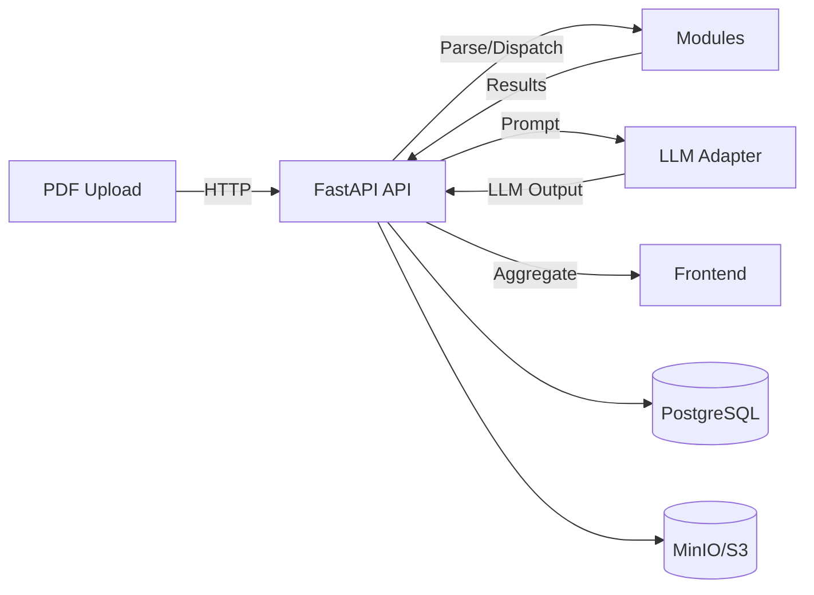
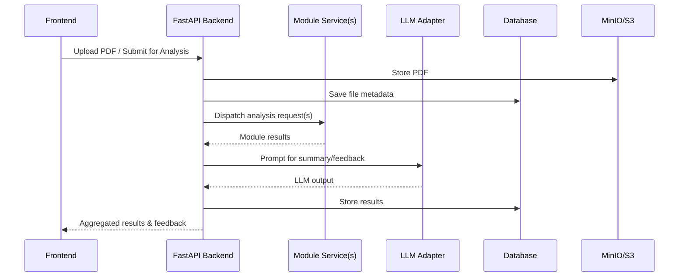

# System Architecture

<!-- anchor: file--directory-structure-frontend-example -->

This page describes the overall system structure of ReViewPoint, with a clear split between Backend and Frontend, and detailed explanations of each segment and their interactions.

---

## System Overview

```mermaid
graph TD
    FE[Frontend: React + Vite + TailwindCSS]
    BE[Backend: FastAPI, SQLAlchemy, Modular Dispatch]
    MOD[Modules: Dockerized Microservices]
    LLM[LLM Adapter: OpenAI/vLLM]
    DB[(PostgreSQL)]
    STORAGE[(MinIO/S3)]
    FILES[(PDF Upload)]
    DOCS[Documentation (MkDocs)]

    FE -->|REST API| BE
    FE --> DOCS
    BE -->|dispatches| MOD
    MOD -->|returns result| BE
    BE -->|prompts| LLM
    BE --> DB
    BE --> STORAGE
    FE -->|renders result| BE
    FILES --> BE
```

---

## Architecture Breakdown

### Backend

- **Core**
  - `config.py`: Centralized settings and environment management
  - `database.py`: Async SQLAlchemy engine/session
  - `logging.py`: Loguru-based logging setup
  - `security.py`: JWT and password hashing utilities
  - `events.py`: Startup/shutdown hooks
- **API**
  - `deps.py`: Dependency injection helpers
  - `v1/`: Versioned API endpoints
    - `auth.py`, `uploads.py`, `users.py`: Auth, file upload, and user endpoints
- **Models**
  - `base.py`: Declarative base
  - `user.py`, `file.py`, `used_password_reset_token.py`: ORM models
- **Repositories**
  - `user.py`, `file.py`: CRUD/data access logic
- **Services**
  - `user.py`, `upload.py`: Business logic for users and uploads
- **Middlewares**
  - `logging.py`: Request/response logging
- **Utils**
  - `hashing.py`, `file.py`, `cache.py`, `errors.py`, `rate_limit.py`, `validation.py`: Utility helpers
- **Migrations**
  - `alembic_migrations/`: Database migration scripts
- **Entry Point**
  - `main.py`: FastAPI app entrypoint

#### Backend Data Flow



---

### Frontend

- **Stack**: React, Vite, TailwindCSS
- **Responsibilities**:
  - User authentication and session management
  - PDF upload and preview
  - Display of module results and LLM summaries
  - Interaction with backend via REST API
  - Responsive UI and error handling

---

## Component Interactions & Rationale

- **Backend ↔ Frontend**: All user actions (upload, login, view results) go through the REST API.
- **Backend ↔ Modules**: Modules are independent microservices, called by the backend dispatcher for analysis tasks.
- **Backend ↔ LLM Layer**: LLM adapters abstract away OpenAI/vLLM specifics, allowing easy provider swaps.
- **Backend ↔ Storage**: All files and metadata are stored in MinIO/S3 and PostgreSQL, respectively.
- **Docs**: MkDocs provides live documentation for contributors and users.

---

## Scalability Features (Expanded)

- **Modular Microservices**: Each analysis module is a Dockerized REST service, independently deployable and testable.
- **Parallel Evaluation**: Backend can dispatch multiple modules in parallel for faster analysis.
- **Plug-and-Play LLM Providers**: Easily switch between OpenAI, vLLM, or future providers.
- **Decoupled CI/CD**: Modules and core backend have separate CI pipelines for independent development.
- **Observability**: Optional Prometheus/Grafana integration for monitoring and metrics.
- **Extensible API**: Versioned API structure allows safe evolution of endpoints.

---

## File & Directory Structure (Backend Example)

### backend/src/

- `alembic_migrations/`: Database migration scripts
- `api/`
  - deps.py
  - v1/
    - auth.py
    - uploads.py
    - users.py
- `core/`
  - config.py
  - database.py
  - events.py
  - logging.py
  - security.py
- `middlewares/`
  - logging.py
- `models/`
  - base.py
  - file.py
  - used_password_reset_token.py
  - user.py
- `repositories/`
  - file.py
  - user.py
- `schemas/`
  - auth.py
  - file.py
  - token.py
  - user.py
- `services/`
  - upload.py
  - user.py
- `utils/`
  - cache.py
  - errors.py
  - file.py
  - hashing.py
  - rate_limit.py
  - validation.py
- `main.py`
- `__about__.py`
- `__init__.py`

---

## File & Directory Structure (Frontend Example)

### frontend/src/

- `components/`: Reusable UI components (buttons, forms, etc.)
- `pages/`: Route-based page components (dashboard, login, etc.)
- `styles/`: CSS/SCSS files for theming and layout
- `utils/`: Shared utility/helper functions
- `main.jsx` or `main.tsx`: Frontend entry point
- `App.jsx` or `App.tsx`: Root application component
- `index.html`: HTML template

---

## Standard Module Output (JSON)

```json
{
  "module_name": "structure_validator",
  "score": 78,
  "status": "warning",
  "feedback": ["Missing conclusion section.", "Introduction too short."],
  "version": "1.0.0"
}
```

---

## Data Flow Summary (Table)

| Step | Description                                      |
| ---- | ------------------------------------------------ |
| 1    | User uploads PDF via Frontend                    |
| 2    | Backend parses and stores file                   |
| 3    | Backend dispatches modules for analysis          |
| 4    | Modules return results to backend                |
| 5    | Backend aggregates results, may call LLM adapter |
| 6    | Aggregated results sent to Frontend for display  |

---

## Module Dispatch & LLM Interaction (Detailed)



---

For more details on each segment, see the [Backend Source Guide](backend-source-guide.md), [Module Guide](module-guide.md), and [Frontend Overview](frontend/overview.md).
