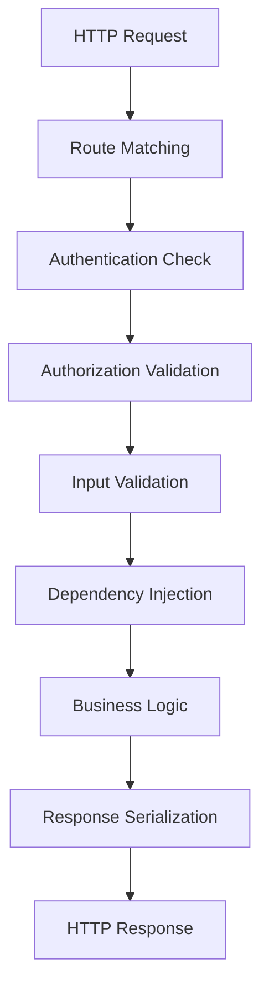

# API Package - FastAPI REST API Implementation

## Purpose

The API package provides the complete REST API implementation for the ReViewPoint platform, implementing FastAPI endpoints that expose business logic from the services layer. This package follows RESTful design principles and provides secure, well-documented, and maintainable HTTP endpoints for frontend applications and external integrations.

## Key Components

### API Architecture

**`API Root`** - Core API infrastructure and shared dependencies:

- **Dependency injection system** for cross-cutting concerns
- **Authentication and authorization** middleware
- **Request/response validation** with Pydantic schemas
- **Error handling** with standardized HTTP responses

**`API v1`** - Version 1 REST endpoints:

- **Authentication endpoints** for login, registration, password management
- **User management** endpoints for profile operations
- **File upload** endpoints for document management
- **Health monitoring** endpoints for system status
- **WebSocket** endpoints for real-time communication

### API Layers

#### Infrastructure Layer (api/)
- **`deps.py`** - Comprehensive dependency injection system
- **`__init__.py`** - API package initialization

#### Endpoint Layer (api/v1/)
- **`auth.py`** - Authentication and authorization endpoints
- **`health.py`** - System health and monitoring endpoints  
- **`uploads.py`** - File upload and management endpoints
- **`websocket.py`** - Real-time WebSocket communication
- **`users/`** - User management endpoint modules

## API Design Principles

### RESTful Architecture

The API follows REST principles with consistent patterns:

#### HTTP Methods
- **GET** - Retrieve resources without side effects
- **POST** - Create new resources or complex operations
- **PUT** - Update existing resources (replace)
- **PATCH** - Partial updates to existing resources
- **DELETE** - Remove resources

#### Response Patterns
- **2xx** - Success responses with appropriate data
- **4xx** - Client errors with validation details
- **5xx** - Server errors with minimal sensitive information
- **Consistent JSON structure** across all endpoints

#### URL Structure
```
/api/v1/{resource}/{id?}/{action?}
```

### Security Implementation

Comprehensive security measures across all endpoints:

#### Authentication Security
- **JWT token validation** for protected endpoints
- **Token blacklisting** for logout and security events
- **Refresh token rotation** for extended sessions
- **API key authentication** for service-to-service communication

#### Authorization Patterns
- **Role-based access control** for administrative functions
- **Resource ownership** validation for user-specific data
- **Feature flag** integration for controlled access
- **Rate limiting** to prevent abuse

#### Input Validation
- **Pydantic schema validation** for all request data
- **SQL injection prevention** through parameterized queries
- **XSS protection** with proper output encoding
- **File upload validation** with type and size restrictions

## Dependency Injection Architecture

### Service Locator Pattern

The API uses a sophisticated dependency injection system:

#### Core Dependencies
- **Database sessions** with async transaction management
- **User authentication** with context propagation
- **Service instances** with lifecycle management
- **Repository access** with testable abstractions

#### Cross-Cutting Concerns
- **Request tracing** with unique ID propagation
- **Error handling** with structured logging
- **Performance monitoring** with metrics collection
- **Feature flag evaluation** for conditional behavior

### Testing Integration

Dependency injection enables comprehensive testing:

#### Mock Dependencies
- **Service mocking** for unit tests
- **Database mocking** for isolated testing
- **Authentication bypassing** for test scenarios
- **External service stubbing** for integration tests

## Request/Response Lifecycle

### Request Processing Pipeline

Comprehensive request processing with security and validation:



#### Security Validation
1. **Authentication verification** - JWT token validation and user lookup
2. **Authorization checking** - Resource access permissions
3. **Input sanitization** - Request data validation and cleaning
4. **Rate limiting** - Request frequency monitoring

#### Business Logic Integration
1. **Service layer coordination** - Business logic execution
2. **Repository pattern usage** - Data access abstraction
3. **Transaction management** - Database consistency
4. **Error handling** - Exception translation to HTTP responses

### Response Standardization

Consistent response formats across all endpoints:

#### Success Responses
```json
{
  "data": {...},
  "message": "Success description",
  "status": "success"
}
```

#### Error Responses
```json
{
  "error": "Error description",
  "details": {...},
  "status": "error"
}
```

#### Validation Errors
```json
{
  "error": "Validation failed",
  "details": {
    "field_name": ["Field-specific error messages"]
  },
  "status": "validation_error"
}
```

## API Versioning Strategy

### Version 1 (Current)

The current API version provides:

#### Core Functionality
- **User authentication** with JWT tokens
- **Profile management** with customizable fields
- **File operations** with secure upload/download
- **Real-time features** with WebSocket communication

#### Stability Guarantees
- **Backward compatibility** for existing endpoints
- **Deprecation notices** for planned changes
- **Migration guides** for breaking changes
- **Version header support** for client specification

### Future Versioning

Planned approach for API evolution:

#### Version Management
- **URL-based versioning** (/api/v2/) for major changes
- **Header-based versioning** for minor variations
- **Feature flags** for gradual rollouts
- **Parallel operation** during transition periods

## Performance Optimization

### Async Operations

Full async support throughout the API:

#### Database Operations
- **Async SQLAlchemy** for non-blocking database access
- **Connection pooling** for efficient resource usage
- **Query optimization** with proper indexing
- **Transaction isolation** for data consistency

#### External Services
- **HTTP client async** for external API calls
- **Caching integration** for frequently accessed data
- **Background tasks** for time-consuming operations
- **Circuit breakers** for resilience

### Caching Strategy

Multi-layer caching for performance:

#### Response Caching
- **HTTP cache headers** for client-side caching
- **CDN integration** for static content
- **Application cache** for computed results
- **Database query cache** for expensive operations

## Error Handling

### Comprehensive Error Management

Structured error handling across all endpoints:

#### Error Categories
- **Validation errors** - Input data problems
- **Authentication errors** - Token and credential issues
- **Authorization errors** - Permission and access problems
- **Business logic errors** - Domain-specific failures
- **System errors** - Infrastructure and unexpected failures

#### Error Response Strategy
- **User-friendly messages** for client consumption
- **Technical details** for debugging (development only)
- **Error codes** for programmatic handling
- **Correlation IDs** for request tracing

### Logging and Monitoring

Comprehensive observability for API operations:

#### Request Logging
- **Request/response logging** with sensitive data masking
- **Performance metrics** with timing information
- **Error tracking** with stack traces
- **User activity** for audit trails

#### Monitoring Integration
- **Health check endpoints** for uptime monitoring
- **Metrics exposure** for performance dashboards
- **Alert integration** for critical failures
- **Distributed tracing** for complex request flows

## Integration Points

### Frontend Integration

Seamless integration with React frontend:

#### Type Generation
- **OpenAPI schema** generation from endpoint definitions
- **TypeScript types** automatic generation for frontend
- **Client SDK** generation for consistent API usage
- **Documentation** automatic generation from code

#### Real-time Features
- **WebSocket endpoints** for live updates
- **Server-sent events** for notifications
- **Polling endpoints** for status checks
- **Event streaming** for activity feeds

### External Service Integration

API designed for extensibility:

#### Service Integration
- **Authentication providers** for SSO integration
- **File storage services** for scalable uploads
- **Notification services** for user communication
- **Analytics services** for usage tracking

#### API Gateway Ready
- **Rate limiting** for traffic control
- **API key management** for access control
- **Request/response transformation** for legacy clients
- **Load balancing** for high availability

## Security Considerations

### Comprehensive Security Model

Multi-layer security throughout the API:

#### Authentication Security
- **JWT token security** with proper signing and validation
- **Token refresh** with secure rotation patterns
- **Session management** with proper invalidation
- **Multi-factor authentication** support (extensible)

#### Data Protection
- **Input sanitization** preventing injection attacks
- **Output encoding** preventing XSS attacks
- **Sensitive data masking** in logs and responses
- **Encryption at rest** for stored credentials

#### API Security
- **CORS configuration** for cross-origin security
- **CSRF protection** for state-changing operations
- **Rate limiting** for abuse prevention
- **Security headers** for additional protection

## Testing Strategy

### Comprehensive Test Coverage

Multi-level testing approach:

#### Unit Testing
- **Endpoint testing** with mock dependencies
- **Dependency testing** with isolated components
- **Schema validation** testing with edge cases
- **Error handling** testing with exception scenarios

#### Integration Testing
- **Database integration** with real connections
- **Service integration** with actual business logic
- **Authentication flow** testing with real tokens
- **File upload** testing with actual files

#### End-to-End Testing
- **Complete workflows** from frontend to database
- **Multi-user scenarios** with concurrent access
- **Performance testing** under load
- **Security testing** with penetration scenarios

## Related Files

- [`deps.py`](deps.py.md) - Comprehensive dependency injection system
- [`v1/__init__.py`](v1/__init__.py.md) - API v1 package initialization
- [`v1/auth.py`](v1/auth.py.md) - Authentication and authorization endpoints
- [`v1/health.py`](v1/health.py.md) - System health monitoring endpoints
- [`v1/uploads.py`](v1/uploads.py.md) - File upload and management endpoints
- [`v1/websocket.py`](v1/websocket.py.md) - Real-time WebSocket communication
- [`v1/users/__init__.py`](v1/users/__init__.py.md) - User management package
- [`../services/user.py`](../services/user.py.md) - User service integration
- [`../services/upload.py`](../services/upload.py.md) - Upload service integration
- [`../schemas/auth.py`](../schemas/auth.py.md) - Authentication request/response schemas
- [`../core/config.py`](../core/config.py.md) - Configuration management
- [`../core/security.py`](../core/security.py.md) - Security utilities and token handling
