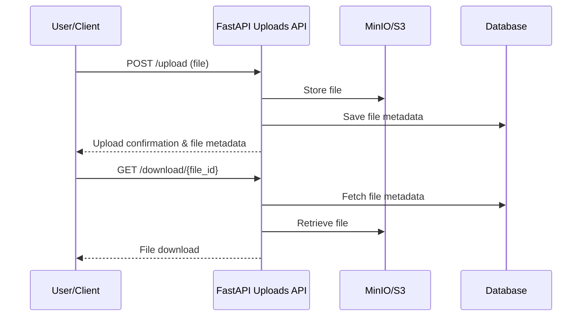

<!-- filepath: c:\Users\00010654\Documents\Git\ReViewPoint\docs\backend\api\v1\uploads.py.md -->

# `api/v1/uploads.py`

| Item               | Value                                                       |
| ------------------ | ----------------------------------------------------------- |
| **Layer**          | API                                                         |
| **Responsibility** | (Stub) Intended for file upload and retrieval API endpoints |
| **Status**         | 🔴 TODO                                                     |

## 1. Purpose

This file is a placeholder for file upload and retrieval endpoints. It will handle file upload requests, return metadata, and provide download links.

## 2. Public API

_None yet. To be implemented._

## 3. Behaviour & Edge-Cases

_None yet. To be implemented._

## 4. Dependencies

- **Internal**: None
- **External**: None

## 5. Tests

| Test file  | Scenario                    |
| ---------- | --------------------------- |
| _None yet_ | _No implementation to test_ |

## 6. Open TODOs

- [ ] Implement file upload and retrieval endpoints

## 7. File Upload Flow Diagram (Planned)

> _This diagram is a placeholder for the future file upload and download flow. Update as endpoints are implemented._
> **Update this page whenever the implementation changes.**
