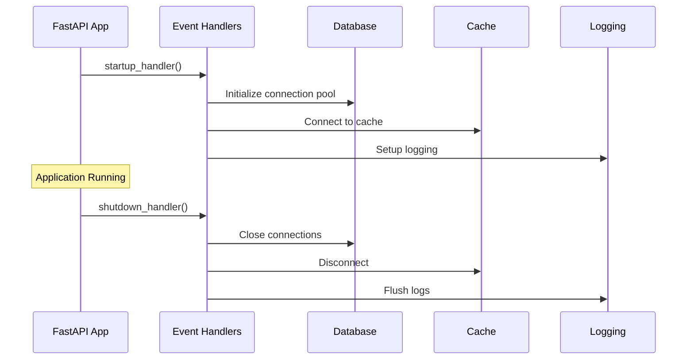

# `core/events.py`

| Item               | Value                                                              |
| ------------------ | ------------------------------------------------------------------ |
| **Layer**          | Core Infrastructure                                                |
| **Responsibility** | Application lifecycle event handling and startup/shutdown hooks   |
| **Status**         | 🟢 Done                                                            |

## 1. Purpose

Manages application lifecycle events in FastAPI, providing hooks for startup and shutdown operations. This module ensures proper initialization and cleanup of resources like database connections, external services, and background tasks.

## 2. Public API

| Symbol       | Type     | Description            |
| ------------ | -------- | ---------------------- |
| `startup_handler` | Function | Application startup event handler |
| `shutdown_handler` | Function | Application shutdown event handler |
| `register_events` | Function | Registers event handlers with FastAPI app |

## 3. Event Handlers

### Startup Events
- Initialize database connection pools
- Set up external service connections (Redis, storage services)
- Initialize logging and monitoring systems
- Validate configuration and environment variables
- Perform health checks on critical dependencies

### Shutdown Events
- Close database connections gracefully
- Disconnect from external services
- Cancel running background tasks
- Flush logs and metrics
- Clean up temporary resources

## 4. Usage Example

```python
from fastapi import FastAPI
from backend.core.events import register_events

app = FastAPI()
register_events(app)

# Events are automatically triggered during app lifecycle
```

## 5. Event Flow



## 6. Dependencies

- **FastAPI**: Event system integration
- **Database**: Connection pool management
- **Logging**: System initialization
- **Configuration**: Environment validation

## 7. Error Handling

- Startup failures prevent application from starting
- Shutdown errors are logged but don't prevent graceful termination
- Critical resource failures trigger appropriate alerts
- Retry logic for transient connection issues

## 8. Monitoring

- Event execution times are logged
- Failed startup/shutdown events trigger alerts
- Health check endpoints verify system state
- Metrics tracked for operational visibility
