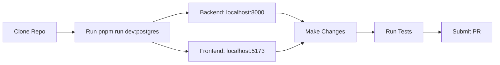
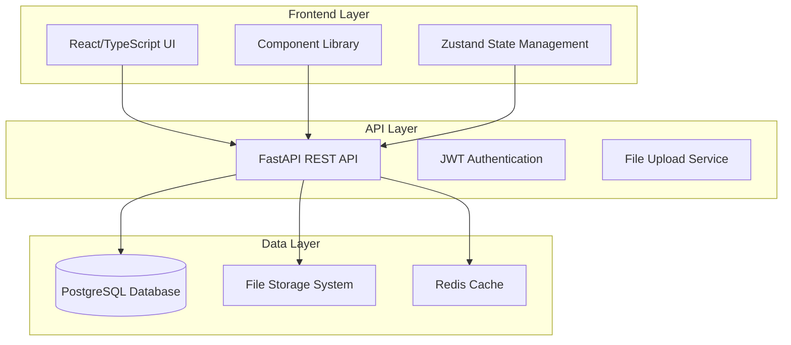
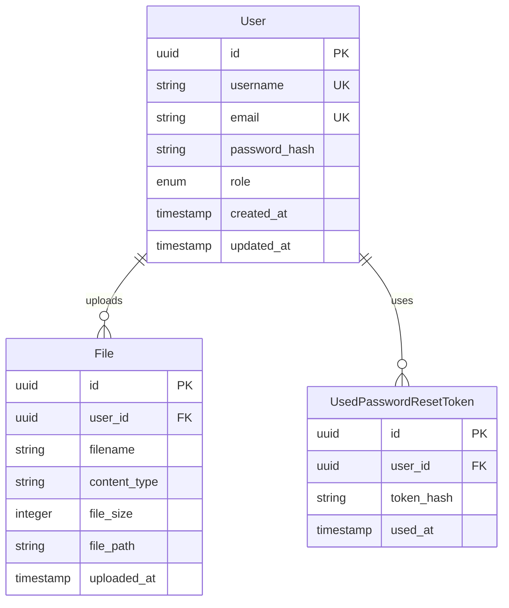

# Developer Documentation

> **Everything you need to develop, test, and contribute to ReViewPoint.**

## 🚀 **Quick Start** (30 seconds)

```bash
# Clone and start everything
git clone https://github.com/filip-herceg/ReViewPoint.git
cd ReViewPoint
pnpm run dev:postgres  # Starts everything: DB + Backend + Frontend
```

**That's it!** Visit `http://localhost:5173` to see the app running.

---

## 📚 **Essential Resources**

<div class="grid cards" markdown>

- :material-cog: **Development Guidelines**

  ***

  Code standards, testing, Git workflow, environment setup

  [View Guidelines →](resources/guidelines.md)

- :material-test-tube: **Testing Guide**

  ***

  Backend tests, frontend tests, E2E tests, coverage reports

  [Testing Docs →](resources/testing.md)

- :material-api: **API Reference**

  ***

  Complete REST API documentation with examples

  [API Docs →](resources/api-reference.md)

- :material-account-plus: **Contributing**

  ***

  How to contribute code, documentation, and report issues

  [Contributing Guide →](resources/contributing.md)

- :material-help-circle: **FAQ**

  ***

  Common questions, troubleshooting, and solutions

  [Browse FAQ →](resources/faq.md)

- :material-folder-cog: **Architecture Deep Dive**

  ***

  Backend and frontend architecture, code organization

  [Backend →](backend/index.md) · [Frontend →](frontend/index.md)

</div>

---

## 🏗️ **Architecture Overview**

### **Tech Stack**

| Layer        | Technology                   | Purpose                     |
| ------------ | ---------------------------- | --------------------------- |
| **Frontend** | React 18 + TypeScript + Vite | Modern UI with hot reload   |
| **Backend**  | FastAPI + Python 3.11+       | High-performance async API  |
| **Database** | PostgreSQL / SQLite          | Reliable data persistence   |
| **Testing**  | Pytest + Vitest + Playwright | Comprehensive test coverage |
| **CI/CD**    | GitHub Actions               | Automated quality gates     |

### **Project Structure**

```text
ReViewPoint/
├── backend/               # FastAPI backend
│   ├── src/              # Source code
│   ├── tests/            # Backend tests (135+ tests)
│   └── alembic/          # Database migrations
├── frontend/             # React frontend
│   ├── src/              # Source code
│   ├── tests/            # Frontend tests (672+ tests)
│   └── e2e/              # End-to-end tests
└── docs/                 # Documentation (you are here!)
```

### **Development Workflow**



---

## ⚡ **VS Code Integration**

ReViewPoint includes **24 VS Code tasks** for streamlined development:

### **Most Used Tasks**

- **`ReViewPoint: Start Development`** - Full stack with PostgreSQL
- **`ReViewPoint: Run All Tests`** - Backend + Frontend tests
- **`ReViewPoint: Install Dependencies`** - One-command setup
- **`ReViewPoint: Format All Code`** - Backend + Frontend formatting

_Access via `Ctrl+Shift+P` → "Tasks: Run Task"_

---

## 🧪 **Testing Strategy**

| Test Type         | Framework  | Coverage       | Command                            |
| ----------------- | ---------- | -------------- | ---------------------------------- |
| **Backend Unit**  | pytest     | 86%+           | `pnpm run test:backend`            |
| **Frontend Unit** | Vitest     | 80%+           | `cd frontend && pnpm test`         |
| **E2E Tests**     | Playwright | Critical paths | `cd frontend && pnpm run test:e2e` |
| **All Tests**     | Combined   | Full suite     | `pnpm run test:all`                |

---

## 🔧 **Development Environment**

### **Prerequisites**

- **Node.js** 18+ with **pnpm** 8+
- **Python** 3.11+ with **Hatch**
- **Docker** (for PostgreSQL)
- **VS Code** (recommended)

### **Database Options**

```bash
# Option 1: SQLite (simple, no Docker)
pnpm run dev

# Option 2: PostgreSQL (production-like)
pnpm run dev:postgres
```

### **Hot Reload Development**

Both backend and frontend support hot reload:

- **Backend**: FastAPI auto-reloads on Python file changes
- **Frontend**: Vite HMR for instant React updates
- **Database**: Automatic migrations on startup

---

## 🎯 **Common Development Tasks**

### **Adding a New Feature**

1. **Create feature branch**: `git checkout -b feature/your-feature`
2. **Backend changes**: Add to `backend/src/`
3. **Frontend changes**: Add to `frontend/src/`
4. **Write tests**: Backend in `backend/tests/`, Frontend in `frontend/tests/`
5. **Test locally**: `pnpm run test:all`
6. **Submit PR**: Follow [Contributing Guidelines](resources/contributing.md)

### **Debugging**

```bash
# Backend debugging with logs
cd backend && hatch run python -m debugpy --listen 5678 --wait-for-client -m uvicorn src.main:app --reload

# Frontend debugging
cd frontend && pnpm run dev --debug

# Database debugging
pnpm run db:reset  # Reset and rebuild database
```

### **Code Quality**

```bash
# Lint and format everything
pnpm run lint:all
pnpm run format:all

# Type checking
cd backend && hatch run mypy src/
cd frontend && pnpm run type-check
```

---

## 🚀 **Production Deployment**

ReViewPoint is production-ready with:

- **Docker containerization** for easy deployment
- **Environment-specific configs** for dev/staging/prod
- **Automated CI/CD** with GitHub Actions
- **Health checks** and monitoring endpoints
- **Security best practices** (JWT, rate limiting, CORS)

---

## 💡 **Getting Help**

**Stuck? Here's where to get help:**

1. **Check the [FAQ](resources/faq.md)** - Common issues and solutions
2. **Browse [Testing Guide](resources/testing.md)** - For test-related questions
3. **Review [Contributing Guide](resources/contributing.md)** - For contribution process
4. **Create GitHub Issue** - For bugs or feature requests
5. **Search the codebase** - Well-documented inline comments

---

**Ready to contribute?** Start with the [Contributing Guide](resources/contributing.md) and make your first PR!

## Architecture Overview

ReViewPoint follows a **modern full-stack architecture** with clear separation of concerns:



### Core Design Principles

1. **Type Safety First**: Full TypeScript coverage with strict checking
2. **Test-Driven Development**: Comprehensive test suites for all components
3. **Performance Optimized**: Async/await patterns, optimized queries, hot reload
4. **Developer Experience**: Automated workflows, comprehensive tooling, clear documentation
5. **Production Ready**: Docker containers, environment management, CI/CD ready

## Project Structure Deep Dive

### Root Directory Layout

```
ReViewPoint/
├── backend/          # FastAPI Python backend
├── frontend/         # React TypeScript frontend
├── docs/            # Documentation (MkDocs)
├── scripts/         # Development automation
├── tests/           # Integration tests
├── uploads/         # File upload storage
└── package.json     # Root workspace configuration
```

### Backend Architecture (`backend/`)

The backend follows a **layered architecture pattern**:

```
backend/
├── src/
│   ├── api/           # FastAPI route handlers
│   │   ├── auth.py    # Authentication endpoints
│   │   ├── users.py   # User management
│   │   └── uploads.py # File upload endpoints
│   ├── core/          # Core application logic
│   │   ├── auth.py    # Authentication service
│   │   ├── cache.py   # Caching layer
│   │   └── config.py  # Configuration management
│   ├── models/        # SQLAlchemy database models
│   │   ├── user.py    # User model
│   │   ├── file.py    # File model
│   │   └── base.py    # Base model class
│   ├── repositories/ # Data access layer
│   ├── schemas/      # Pydantic request/response schemas
│   ├── services/     # Business logic layer
│   └── main.py       # FastAPI application entry point
├── tests/           # Backend tests (135+ tests)
├── config/          # Environment configuration
└── deployment/      # Docker and deployment configs
```

#### Key Backend Technologies

- **FastAPI**: Modern, fast web framework for building APIs
- **SQLAlchemy 2.0**: Modern Python SQL toolkit with async support
- **Alembic**: Database migration tool
- **PostgreSQL**: Primary production database
- **JWT**: Secure authentication with token-based auth
- **Pytest**: Comprehensive testing framework

### Frontend Architecture (`frontend/`)

The frontend uses a **component-based architecture**:

```
frontend/
├── src/
│   ├── components/    # Reusable UI components
│   │   ├── ui/        # Basic UI elements
│   │   ├── layout/    # Layout components
│   │   ├── auth/      # Authentication components
│   │   └── uploads/   # File upload components
│   ├── pages/         # Route-level components
│   ├── lib/           # Core libraries and utilities
│   │   ├── api/       # API client configuration
│   │   ├── auth/      # Authentication logic
│   │   └── utils/     # Helper functions
│   ├── hooks/         # Custom React hooks
│   ├── types/         # TypeScript type definitions
│   └── App.tsx        # Main application component
├── tests/            # Frontend tests
└── e2e/             # End-to-end tests (Playwright)
```

#### Key Frontend Technologies

- **React 18**: Modern React with concurrent features
- **TypeScript**: Type-safe JavaScript development
- **Vite**: Fast build tool and development server
- **Tailwind CSS**: Utility-first CSS framework
- **Zustand**: Lightweight state management
- **React Router**: Client-side routing
- **Vitest**: Fast unit testing framework
- **Playwright**: End-to-end testing

## Development Workflows

### Daily Development

We've automated the most common development tasks through VS Code tasks and npm scripts:

#### Start Complete Development Environment

```bash
# Option 1: PostgreSQL (recommended)
pnpm run dev:postgres

# Option 2: SQLite (simpler, no Docker required)
pnpm run dev
```

#### Backend Development

```bash
# Start backend only
pnpm run backend

# Run tests (fast SQLite mode)
cd backend && hatch run fast:test

# Run tests (full PostgreSQL mode)
cd backend && hatch run pytest

# Lint and format
cd backend && hatch run ruff check . --fix
cd backend && hatch run ruff format .
```

#### Frontend Development

```bash
# Start frontend only
cd frontend && pnpm run dev

# Run tests
cd frontend && pnpm run test

# Lint and format
cd frontend && pnpm run lint
cd frontend && pnpm run format

# Type checking
cd frontend && pnpm run type-check
```

### Testing Strategy

We maintain **comprehensive testing** at multiple levels:

#### Backend Testing (135+ tests)

1. **Fast Tests** (SQLite in-memory, 30-60 seconds)

   ```bash
   cd backend && hatch run fast:test
   ```

2. **Full Tests** (PostgreSQL, 2-5 minutes)

   ```bash
   cd backend && hatch run pytest
   ```

3. **Coverage Reports**

   ```bash
   cd backend && hatch run fast:coverage
   ```

#### Frontend Testing

1. **Unit Tests** (Vitest)

   ```bash
   cd frontend && pnpm run test
   ```

2. **E2E Tests** (Playwright)

   ```bash
   cd frontend && pnpm run test:e2e
   ```

3. **Coverage Reports**

   ```bash
   cd frontend && pnpm run test:coverage
   ```

### VS Code Integration

We provide **28 pre-configured VS Code tasks** for all development operations:

#### Most Used Tasks

- **ReViewPoint: Start Both (Backend + Frontend) - PostgreSQL** (Default, Ctrl+Shift+P → "Tasks: Run Task")
- **ReViewPoint: Run All Tests**
- **ReViewPoint: Lint Backend**
- **ReViewPoint: Lint Frontend**

#### Complete Task Categories

1. **Development Tasks** (4): Starting services
2. **Testing Tasks** (7): All types of test execution
3. **Quality Tasks** (5): Linting, formatting, type checking
4. **Build Tasks** (4): Production builds
5. **Database Tasks** (6): Migrations, switching databases
6. **Utility Tasks** (2): Dependency management, cleaning

## Database Architecture

### Schema Design

Our database follows **normalized design principles** with clear relationships:



### Migration Management

We use **Alembic** for database versioning:

```bash
# Create new migration
cd backend && hatch run alembic revision --autogenerate -m "Description"

# Apply migrations
cd backend && hatch run alembic upgrade head

# View migration history
cd backend && hatch run alembic history
```

### Database Switching

Easy switching between development databases:

```bash
# Switch to PostgreSQL (production-like)
pnpm run db:postgres

# Switch to SQLite (simpler development)
pnpm run db:sqlite
```

## API Design & Documentation

### API Architecture

Our API follows **RESTful principles** with comprehensive documentation:

- **Base URL**: `http://localhost:8000/api/v1`
- **Authentication**: JWT Bearer tokens
- **Documentation**: Auto-generated OpenAPI/Swagger at `/docs`
- **Response Format**: Consistent JSON with proper HTTP status codes

### API Endpoints Overview

#### Authentication (`/auth`)

- `POST /auth/register` - User registration
- `POST /auth/login` - User login
- `POST /auth/refresh` - Token refresh
- `POST /auth/logout` - User logout
- `POST /auth/password-reset-request` - Request password reset
- `POST /auth/password-reset-confirm` - Confirm password reset

#### Users (`/users`)

- `GET /users/me` - Get current user profile
- `PUT /users/me` - Update current user profile
- `GET /users/{user_id}` - Get user by ID (admin)
- `GET /users/` - List users (admin)

#### File Uploads (`/uploads`)

- `POST /uploads/` - Upload file
- `GET /uploads/{file_id}` - Get file metadata
- `GET /uploads/{file_id}/download` - Download file
- `DELETE /uploads/{file_id}` - Delete file

### Type Safety

We generate **TypeScript types** from the OpenAPI schema:

```bash
# Generate frontend types from backend API
cd frontend && pnpm run generate:types
```

This ensures **compile-time type safety** between frontend and backend.

## Security Implementation

### Authentication & Authorization

1. **JWT Tokens**: Secure token-based authentication
2. **Password Security**: Bcrypt hashing with proper salting
3. **Role-Based Access Control (RBAC)**: User roles and permissions
4. **Token Refresh**: Secure token rotation
5. **Password Reset**: Secure password reset flow with token invalidation

### File Upload Security

1. **File Type Validation**: Strict file type checking
2. **File Size Limits**: Configurable upload size limits
3. **Virus Scanning**: Integration points for virus scanning
4. **Access Control**: File access based on user permissions
5. **Secure Storage**: Files stored outside web root

### API Security

1. **Input Validation**: Pydantic schema validation
2. **SQL Injection Prevention**: SQLAlchemy parameterized queries
3. **CORS Configuration**: Properly configured CORS policies
4. **Rate Limiting**: API rate limiting (configurable)
5. **HTTPS Enforcement**: Production HTTPS configuration

## Performance & Optimization

### Backend Performance

1. **Async Operations**: Full async/await pattern usage
2. **Database Optimization**: Optimized queries, connection pooling
3. **Caching Layer**: Redis integration for session and data caching
4. **Background Tasks**: Celery integration for async task processing

### Frontend Performance

1. **Code Splitting**: Automatic route-based code splitting
2. **Bundle Optimization**: Vite-optimized bundling
3. **Lazy Loading**: Component and route lazy loading
4. **Image Optimization**: Optimized image loading and caching

## Contributing Guidelines

### Code Standards

1. **Type Safety**: All code must be fully typed
2. **Test Coverage**: All new features require tests
3. **Documentation**: All public APIs must be documented
4. **Code Review**: All changes require review
5. **Linting**: Code must pass all linting checks

### Development Process

1. **Feature Branches**: Work on feature branches
2. **Commit Messages**: Use conventional commit format
3. **Pull Requests**: Use PR templates
4. **Testing**: All tests must pass
5. **Documentation**: Update docs with changes

### Getting Help

1. **Documentation**: Start with this documentation
2. **Code Examples**: Check existing code patterns
3. **Issues**: Create GitHub issues for bugs
4. **Discussions**: Use GitHub discussions for questions
5. **Code Review**: Request reviews early and often

## Troubleshooting Common Issues

### Database Issues

**PostgreSQL won't start:**

```bash
# Check Docker status
docker ps

# Restart PostgreSQL
pnpm run postgres:stop
pnpm run postgres:start
```

**Migration errors:**

```bash
# Reset database (destroys data!)
cd backend && hatch run alembic downgrade base
cd backend && hatch run alembic upgrade head
```

### Development Server Issues

**Port conflicts:**

- Backend: Change port in `backend/config/.env`
- Frontend: Change port in `frontend/vite.config.ts`

**Hot reload not working:**

- Restart the development server
- Check file watchers (VS Code settings)

### Testing Issues

**Tests failing:**

```bash
# Clear test cache
cd backend && hatch run pytest --cache-clear

# Reset test database
cd backend && hatch run fast:test --create-db
```

## Next Steps

### For New Developers

1. **Setup**: Follow the [Installation Guide](installation.md)
2. **Architecture**: Read the [Backend](backend/index.md) and [Frontend](frontend/index.md) documentation
3. **Testing**: Review the [Testing Guide](resources/testing.md)
4. **Contributing**: Check the [Contributing Guidelines](resources/contributing.md)

### For Advanced Users

1. **Deployment**: Review deployment documentation
2. **Performance**: Study performance optimization guides
3. **Security**: Understand security implementation details
4. **Scaling**: Learn about horizontal scaling options

---

**This developer overview provides the foundation for understanding and contributing to ReViewPoint. For specific technical details, explore the linked documentation sections.**
