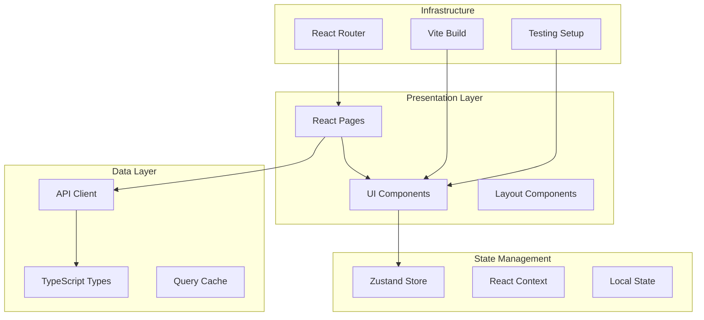

# Frontend Documentation

The ReViewPoint frontend is a **modern React application** built with TypeScript, providing an intuitive and responsive user interface for the ReViewPoint platform. This section contains comprehensive documentation for all frontend components, architecture, and development practices.

## Overview

### Architecture at a Glance

The frontend follows **modern React patterns** with a focus on type safety, performance, and maintainability:



### Key Technologies

| Technology | Version | Purpose |
|------------|---------|---------|
| **React** | 18+ | Modern UI library with concurrent features |
| **TypeScript** | 5+ | Type-safe JavaScript development |
| **Vite** | 5+ | Fast build tool and development server |
| **Tailwind CSS** | 3+ | Utility-first CSS framework |
| **Zustand** | 4+ | Lightweight state management |
| **React Router** | 6+ | Client-side routing |
| **Vitest** | 1+ | Fast unit testing framework |
| **Playwright** | 1+ | End-to-end testing |

## Quick Navigation

### 🚀 **Getting Started**

- [Component Library](#component-library) - Reusable UI components
- [State Management](#state-management) - Application state patterns
- [Routing System](#routing-system) - Navigation and page structure
- [API Integration](#api-integration) - Backend communication

### 🔧 **Development**

- [Project Structure](#project-structure) - Directory organization
- [Development Workflow](#development-workflow) - Daily development tasks
- [Testing Strategy](#testing-strategy) - Unit and E2E testing
- [Build System](#build-system) - Vite configuration

### 🎨 **UI/UX**

- [Design System](#design-system) - Color, typography, spacing
- [Component Patterns](#component-patterns) - Reusable patterns
- [Accessibility](#accessibility) - A11y implementation
- [Responsive Design](#responsive-design) - Mobile-first approach

## Project Structure

```
frontend/
├── src/                    # Source code
│   ├── components/        # Reusable UI components
│   │   ├── ui/           # Basic UI elements (buttons, inputs, etc.)
│   │   ├── layout/       # Layout components (header, sidebar, etc.)
│   │   ├── auth/         # Authentication components
│   │   ├── uploads/      # File upload components
│   │   └── forms/        # Form components
│   ├── pages/            # Route-level components
│   │   ├── Home.tsx      # Home page
│   │   ├── Login.tsx     # Login page
│   │   ├── Dashboard.tsx # Dashboard page
│   │   └── Profile.tsx   # Profile page
│   ├── lib/              # Core libraries and utilities
│   │   ├── api/          # API client configuration
│   │   ├── auth/         # Authentication logic
│   │   ├── utils/        # Utility functions
│   │   └── constants/    # Application constants
│   ├── hooks/            # Custom React hooks
│   │   ├── useAuth.ts    # Authentication hook
│   │   ├── useApi.ts     # API hook
│   │   └── useUpload.ts  # File upload hook
│   ├── store/            # Zustand state management
│   │   ├── auth.ts       # Authentication store
│   │   ├── ui.ts         # UI state store
│   │   └── uploads.ts    # Upload state store
│   ├── types/            # TypeScript type definitions
│   │   ├── api.ts        # API response types
│   │   ├── auth.ts       # Authentication types
│   │   └── global.ts     # Global types
│   ├── styles/           # Styling and themes
│   │   ├── globals.css   # Global styles
│   │   └── components.css # Component-specific styles
│   ├── App.tsx           # Main application component
│   ├── main.tsx          # Application entry point
│   └── router.tsx        # Routing configuration
├── tests/                # Unit tests
│   ├── components/       # Component tests
│   ├── hooks/           # Hook tests
│   ├── utils/           # Utility tests
│   └── setup.ts         # Test setup
├── e2e/                  # End-to-end tests
│   ├── auth.spec.ts     # Authentication E2E tests
│   ├── upload.spec.ts   # Upload E2E tests
│   └── navigation.spec.ts # Navigation E2E tests
├── public/               # Static assets
│   ├── icons/           # Icon files
│   └── images/          # Image assets
├── index.html           # HTML template
├── package.json         # Project dependencies
├── tsconfig.json        # TypeScript configuration
├── vite.config.ts       # Vite configuration
├── tailwind.config.js   # Tailwind CSS configuration
├── vitest.config.ts     # Vitest testing configuration
└── playwright.config.ts  # Playwright E2E configuration
```

## Component Library

### UI Components Architecture

Our component library follows **atomic design principles**:

#### Atoms (Basic Building Blocks)

```typescript
// components/ui/Button.tsx
interface ButtonProps extends React.ButtonHTMLAttributes<HTMLButtonElement> {
  variant?: 'primary' | 'secondary' | 'outline' | 'ghost'
  size?: 'sm' | 'md' | 'lg'
  loading?: boolean
}

export const Button: React.FC<ButtonProps> = ({
  variant = 'primary',
  size = 'md',
  loading = false,
  children,
  className,
  ...props
}) => {
  return (
    <button
      className={cn(
        buttonVariants({ variant, size }),
        loading && 'opacity-50 cursor-not-allowed',
        className
      )}
      disabled={loading}
      {...props}
    >
      {loading && <Spinner className="mr-2" />}
      {children}
    </button>
  )
}
```

#### Molecules (Component Combinations)

```typescript
// components/ui/FileUpload.tsx
interface FileUploadProps {
  onUpload: (file: File) => Promise<void>
  accept?: string
  maxSize?: number
  multiple?: boolean
}

export const FileUpload: React.FC<FileUploadProps> = ({
  onUpload,
  accept,
  maxSize,
  multiple = false
}) => {
  const [dragActive, setDragActive] = useState(false)
  const [uploading, setUploading] = useState(false)

  const handleDrop = useCallback(async (e: React.DragEvent) => {
    e.preventDefault()
    setDragActive(false)
    
    const files = Array.from(e.dataTransfer.files)
    for (const file of files) {
      if (validateFile(file, accept, maxSize)) {
        setUploading(true)
        await onUpload(file)
        setUploading(false)
      }
    }
  }, [onUpload, accept, maxSize])

  return (
    <div
      className={cn(
        "border-2 border-dashed rounded-lg p-6 text-center",
        dragActive ? "border-primary bg-primary/5" : "border-gray-300",
        uploading && "opacity-50"
      )}
      onDrop={handleDrop}
      onDragOver={(e) => e.preventDefault()}
      onDragEnter={() => setDragActive(true)}
      onDragLeave={() => setDragActive(false)}
    >
      <Upload className="mx-auto h-12 w-12 text-gray-400" />
      <p className="mt-2 text-sm text-gray-600">
        Drop files here or click to browse
      </p>
      <input
        type="file"
        accept={accept}
        multiple={multiple}
        className="hidden"
        onChange={handleFileSelect}
      />
    </div>
  )
}
```

#### Organisms (Complex Components)

```typescript
// components/auth/LoginForm.tsx
interface LoginFormProps {
  onSuccess?: () => void
  redirectTo?: string
}

export const LoginForm: React.FC<LoginFormProps> = ({
  onSuccess,
  redirectTo = '/'
}) => {
  const { login } = useAuth()
  const navigate = useNavigate()
  
  const form = useForm<LoginSchema>({
    resolver: zodResolver(loginSchema),
    defaultValues: {
      username: '',
      password: ''
    }
  })

  const onSubmit = async (data: LoginSchema) => {
    try {
      await login(data)
      onSuccess?.()
      navigate(redirectTo)
    } catch (error) {
      form.setError('root', {
        message: 'Invalid username or password'
      })
    }
  }

  return (
    <Card className="w-full max-w-md">
      <CardHeader>
        <CardTitle>Sign In</CardTitle>
        <CardDescription>
          Enter your credentials to access your account
        </CardDescription>
      </CardHeader>
      <CardContent>
        <Form {...form}>
          <form onSubmit={form.handleSubmit(onSubmit)} className="space-y-4">
            <FormField
              control={form.control}
              name="username"
              render={({ field }) => (
                <FormItem>
                  <FormLabel>Username</FormLabel>
                  <FormControl>
                    <Input placeholder="Enter your username" {...field} />
                  </FormControl>
                  <FormMessage />
                </FormItem>
              )}
            />
            <FormField
              control={form.control}
              name="password"
              render={({ field }) => (
                <FormItem>
                  <FormLabel>Password</FormLabel>
                  <FormControl>
                    <Input type="password" placeholder="Enter your password" {...field} />
                  </FormControl>
                  <FormMessage />
                </FormItem>
              )}
            />
            <Button type="submit" className="w-full" loading={form.formState.isSubmitting}>
              Sign In
            </Button>
          </form>
        </Form>
      </CardContent>
    </Card>
  )
}
```

## State Management

### Zustand Store Architecture

We use **Zustand** for simple, efficient state management:

#### Authentication Store

```typescript
// store/auth.ts
interface AuthState {
  user: User | null
  token: string | null
  isAuthenticated: boolean
  isLoading: boolean
}

interface AuthActions {
  login: (credentials: LoginCredentials) => Promise<void>
  logout: () => void
  refreshToken: () => Promise<void>
  updateProfile: (data: UpdateProfileData) => Promise<void>
}

export const useAuthStore = create<AuthState & AuthActions>((set, get) => ({
  // State
  user: null,
  token: localStorage.getItem('access_token'),
  isAuthenticated: false,
  isLoading: false,

  // Actions
  login: async (credentials) => {
    set({ isLoading: true })
    try {
      const response = await authAPI.login(credentials)
      const { access_token, user } = response.data
      
      localStorage.setItem('access_token', access_token)
      set({
        user,
        token: access_token,
        isAuthenticated: true,
        isLoading: false
      })
    } catch (error) {
      set({ isLoading: false })
      throw error
    }
  },

  logout: () => {
    localStorage.removeItem('access_token')
    set({
      user: null,
      token: null,
      isAuthenticated: false
    })
  },

  refreshToken: async () => {
    try {
      const response = await authAPI.refresh()
      const { access_token } = response.data
      
      localStorage.setItem('access_token', access_token)
      set({ token: access_token })
    } catch (error) {
      get().logout()
      throw error
    }
  },

  updateProfile: async (data) => {
    const user = await userAPI.updateProfile(data)
    set({ user })
  }
}))
```

#### UI State Store

```typescript
// store/ui.ts
interface UIState {
  theme: 'light' | 'dark' | 'system'
  sidebarOpen: boolean
  notifications: Notification[]
}

interface UIActions {
  setTheme: (theme: UIState['theme']) => void
  toggleSidebar: () => void
  addNotification: (notification: Omit<Notification, 'id'>) => void
  removeNotification: (id: string) => void
}

export const useUIStore = create<UIState & UIActions>((set, get) => ({
  // State
  theme: (localStorage.getItem('theme') as UIState['theme']) || 'system',
  sidebarOpen: true,
  notifications: [],

  // Actions
  setTheme: (theme) => {
    localStorage.setItem('theme', theme)
    set({ theme })
  },

  toggleSidebar: () => {
    set((state) => ({ sidebarOpen: !state.sidebarOpen }))
  },

  addNotification: (notification) => {
    const id = Math.random().toString(36).substr(2, 9)
    set((state) => ({
      notifications: [...state.notifications, { ...notification, id }]
    }))
    
    // Auto-remove after delay
    setTimeout(() => {
      get().removeNotification(id)
    }, notification.duration || 5000)
  },

  removeNotification: (id) => {
    set((state) => ({
      notifications: state.notifications.filter(n => n.id !== id)
    }))
  }
}))
```

## API Integration

### Type-Safe API Client

We generate TypeScript types from the backend OpenAPI schema:

```bash
# Generate types from backend API
cd frontend
pnpm run generate:types
```

#### API Client Configuration

```typescript
// lib/api/client.ts
import axios from 'axios'
import { useAuthStore } from '@/store/auth'

const API_BASE_URL = import.meta.env.VITE_API_URL || 'http://localhost:8000/api/v1'

export const apiClient = axios.create({
  baseURL: API_BASE_URL,
  timeout: 10000,
  headers: {
    'Content-Type': 'application/json'
  }
})

// Request interceptor for authentication
apiClient.interceptors.request.use((config) => {
  const token = useAuthStore.getState().token
  if (token) {
    config.headers.Authorization = `Bearer ${token}`
  }
  return config
})

// Response interceptor for error handling
apiClient.interceptors.response.use(
  (response) => response,
  async (error) => {
    if (error.response?.status === 401) {
      const authStore = useAuthStore.getState()
      try {
        await authStore.refreshToken()
        // Retry the original request
        return apiClient.request(error.config)
      } catch (refreshError) {
        authStore.logout()
        window.location.href = '/login'
      }
    }
    return Promise.reject(error)
  }
)
```

#### API Service Modules

```typescript
// lib/api/auth.ts
export const authAPI = {
  login: (credentials: LoginCredentials) =>
    apiClient.post<AuthResponse>('/auth/login', credentials),
    
  register: (data: RegisterData) =>
    apiClient.post<UserResponse>('/auth/register', data),
    
  refresh: () =>
    apiClient.post<AuthResponse>('/auth/refresh'),
    
  logout: () =>
    apiClient.post('/auth/logout'),
    
  requestPasswordReset: (email: string) =>
    apiClient.post('/auth/password-reset-request', { email }),
    
  confirmPasswordReset: (data: PasswordResetData) =>
    apiClient.post('/auth/password-reset-confirm', data)
}

// lib/api/users.ts
export const userAPI = {
  getProfile: () =>
    apiClient.get<UserResponse>('/users/me'),
    
  updateProfile: (data: UpdateProfileData) =>
    apiClient.put<UserResponse>('/users/me', data),
    
  getUser: (id: string) =>
    apiClient.get<UserResponse>(`/users/${id}`),
    
  listUsers: (params?: ListUsersParams) =>
    apiClient.get<UsersListResponse>('/users', { params })
}
```

## Routing System

### Route Configuration

```typescript
// router.tsx
import { createBrowserRouter } from 'react-router-dom'
import { Layout } from '@/components/layout/Layout'
import { ProtectedRoute } from '@/components/auth/ProtectedRoute'

export const router = createBrowserRouter([
  {
    path: '/',
    element: <Layout />,
    children: [
      {
        index: true,
        element: <Home />
      },
      {
        path: 'login',
        element: <Login />
      },
      {
        path: 'register',
        element: <Register />
      },
      {
        path: 'dashboard',
        element: (
          <ProtectedRoute>
            <Dashboard />
          </ProtectedRoute>
        )
      },
      {
        path: 'profile',
        element: (
          <ProtectedRoute>
            <Profile />
          </ProtectedRoute>
        )
      },
      {
        path: 'uploads',
        element: (
          <ProtectedRoute>
            <Uploads />
          </ProtectedRoute>
        )
      }
    ]
  }
])
```

### Protected Routes

```typescript
// components/auth/ProtectedRoute.tsx
interface ProtectedRouteProps {
  children: React.ReactNode
  requiredRole?: string
}

export const ProtectedRoute: React.FC<ProtectedRouteProps> = ({
  children,
  requiredRole
}) => {
  const { isAuthenticated, user, isLoading } = useAuthStore()
  const location = useLocation()

  if (isLoading) {
    return <LoadingSpinner />
  }

  if (!isAuthenticated) {
    return <Navigate to="/login" state={{ from: location }} replace />
  }

  if (requiredRole && user?.role !== requiredRole) {
    return <Navigate to="/unauthorized" replace />
  }

  return <>{children}</>
}
```

## Testing Strategy

### Unit Testing with Vitest

```typescript
// tests/components/Button.test.tsx
import { render, screen, fireEvent } from '@testing-library/react'
import { describe, it, expect, vi } from 'vitest'
import { Button } from '@/components/ui/Button'

describe('Button Component', () => {
  it('renders with correct text', () => {
    render(<Button>Click me</Button>)
    expect(screen.getByText('Click me')).toBeInTheDocument()
  })

  it('calls onClick handler when clicked', () => {
    const handleClick = vi.fn()
    render(<Button onClick={handleClick}>Click me</Button>)
    
    fireEvent.click(screen.getByText('Click me'))
    expect(handleClick).toHaveBeenCalledTimes(1)
  })

  it('shows loading state', () => {
    render(<Button loading>Loading</Button>)
    expect(screen.getByText('Loading')).toHaveClass('opacity-50')
  })

  it('applies correct variant classes', () => {
    render(<Button variant="secondary">Secondary</Button>)
    expect(screen.getByText('Secondary')).toHaveClass('bg-secondary')
  })
})
```

### E2E Testing with Playwright

```typescript
// e2e/auth.spec.ts
import { test, expect } from '@playwright/test'

test.describe('Authentication Flow', () => {
  test('user can login successfully', async ({ page }) => {
    await page.goto('/login')
    
    await page.fill('[data-testid="username"]', 'testuser')
    await page.fill('[data-testid="password"]', 'testpassword')
    await page.click('[data-testid="login-button"]')
    
    await expect(page).toHaveURL('/dashboard')
    await expect(page.locator('[data-testid="user-menu"]')).toBeVisible()
  })

  test('shows error for invalid credentials', async ({ page }) => {
    await page.goto('/login')
    
    await page.fill('[data-testid="username"]', 'wronguser')
    await page.fill('[data-testid="password"]', 'wrongpassword')
    await page.click('[data-testid="login-button"]')
    
    await expect(page.locator('[data-testid="error-message"]')).toBeVisible()
    await expect(page.locator('[data-testid="error-message"]')).toContainText('Invalid')
  })

  test('user can logout', async ({ page }) => {
    // Login first
    await page.goto('/login')
    await page.fill('[data-testid="username"]', 'testuser')
    await page.fill('[data-testid="password"]', 'testpassword')
    await page.click('[data-testid="login-button"]')
    
    // Then logout
    await page.click('[data-testid="user-menu"]')
    await page.click('[data-testid="logout-button"]')
    
    await expect(page).toHaveURL('/login')
  })
})
```

## Development Workflow

### Daily Development Commands

```bash
# Start frontend development server
cd frontend
pnpm run dev

# Or use the npm script from root
pnpm run frontend
```

### Code Quality

```bash
# Lint code
cd frontend
pnpm run lint

# Format code
cd frontend
pnpm run format

# Type checking
cd frontend
pnpm run type-check
```

### Testing

```bash
# Unit tests
cd frontend
pnpm run test

# E2E tests
cd frontend
pnpm run test:e2e

# Coverage
cd frontend
pnpm run test:coverage
```

### Build

```bash
# Production build
cd frontend
pnpm run build

# Preview production build
cd frontend
pnpm run preview
```

## Design System

### Color Palette

```css
/* Tailwind CSS theme configuration */
:root {
  --background: 0 0% 100%;
  --foreground: 222.2 84% 4.9%;
  --primary: 221.2 83.2% 53.3%;
  --primary-foreground: 210 40% 98%;
  --secondary: 210 40% 96%;
  --secondary-foreground: 222.2 84% 4.9%;
  --muted: 210 40% 96%;
  --muted-foreground: 215.4 16.3% 46.9%;
  --accent: 210 40% 96%;
  --accent-foreground: 222.2 84% 4.9%;
  --destructive: 0 84.2% 60.2%;
  --destructive-foreground: 210 40% 98%;
  --border: 214.3 31.8% 91.4%;
  --input: 214.3 31.8% 91.4%;
  --ring: 221.2 83.2% 53.3%;
}

.dark {
  --background: 222.2 84% 4.9%;
  --foreground: 210 40% 98%;
  --primary: 217.2 91.2% 59.8%;
  --primary-foreground: 222.2 84% 4.9%;
  /* ... dark theme values */
}
```

### Typography Scale

```css
/* Typography classes */
.text-display-1 { font-size: 3.5rem; line-height: 1.2; font-weight: 700; }
.text-display-2 { font-size: 3rem; line-height: 1.25; font-weight: 700; }
.text-heading-1 { font-size: 2.5rem; line-height: 1.3; font-weight: 600; }
.text-heading-2 { font-size: 2rem; line-height: 1.35; font-weight: 600; }
.text-heading-3 { font-size: 1.5rem; line-height: 1.4; font-weight: 600; }
.text-body-large { font-size: 1.125rem; line-height: 1.5; font-weight: 400; }
.text-body { font-size: 1rem; line-height: 1.5; font-weight: 400; }
.text-body-small { font-size: 0.875rem; line-height: 1.5; font-weight: 400; }
.text-caption { font-size: 0.75rem; line-height: 1.4; font-weight: 400; }
```

### Spacing System

```javascript
// Tailwind spacing configuration
module.exports = {
  theme: {
    spacing: {
      'xs': '0.5rem',    // 8px
      'sm': '1rem',      // 16px
      'md': '1.5rem',    // 24px
      'lg': '2rem',      // 32px
      'xl': '3rem',      // 48px
      '2xl': '4rem',     // 64px
      '3xl': '6rem',     // 96px
    }
  }
}
```

## Build System

### Vite Configuration

```typescript
// vite.config.ts
import { defineConfig } from 'vite'
import react from '@vitejs/plugin-react'
import path from 'path'

export default defineConfig({
  plugins: [react()],
  resolve: {
    alias: {
      '@': path.resolve(__dirname, './src'),
    },
  },
  server: {
    port: 3000,
    proxy: {
      '/api': {
        target: 'http://localhost:8000',
        changeOrigin: true,
      },
    },
  },
  build: {
    outDir: 'dist',
    sourcemap: true,
    rollupOptions: {
      output: {
        manualChunks: {
          vendor: ['react', 'react-dom'],
          router: ['react-router-dom'],
          ui: ['@radix-ui/react-dialog', '@radix-ui/react-dropdown-menu'],
        },
      },
    },
  },
  optimizeDeps: {
    include: ['react', 'react-dom', 'react-router-dom'],
  },
})
```

### Environment Variables

```bash
# .env.local
VITE_API_URL=http://localhost:8000/api/v1
VITE_APP_NAME=ReViewPoint
VITE_ENVIRONMENT=development
```

## Performance Optimization

### Code Splitting

```typescript
// Lazy loading for route components
const Dashboard = lazy(() => import('@/pages/Dashboard'))
const Profile = lazy(() => import('@/pages/Profile'))
const Uploads = lazy(() => import('@/pages/Uploads'))

// Usage with Suspense
<Suspense fallback={<LoadingSpinner />}>
  <Dashboard />
</Suspense>
```

### Memoization

```typescript
// Memoizing expensive components
const ExpensiveComponent = memo(({ data }: { data: ComplexData }) => {
  const processedData = useMemo(() => {
    return expensiveDataProcessing(data)
  }, [data])

  return <div>{/* Render processed data */}</div>
})

// Memoizing callback functions
const ParentComponent = () => {
  const [items, setItems] = useState<Item[]>([])

  const handleItemClick = useCallback((id: string) => {
    setItems(prev => prev.map(item => 
      item.id === id ? { ...item, selected: !item.selected } : item
    ))
  }, [])

  return (
    <div>
      {items.map(item => (
        <ItemComponent key={item.id} item={item} onClick={handleItemClick} />
      ))}
    </div>
  )
}
```

## Accessibility

### ARIA Implementation

```typescript
// Accessible button component
export const Button = forwardRef<HTMLButtonElement, ButtonProps>(
  ({ children, loading, ...props }, ref) => {
    return (
      <button
        ref={ref}
        aria-disabled={loading}
        aria-describedby={loading ? 'loading-text' : undefined}
        {...props}
      >
        {loading && (
          <span id="loading-text" className="sr-only">
            Loading...
          </span>
        )}
        {children}
      </button>
    )
  }
)

// Accessible form field
export const FormField = ({ label, error, children, ...props }) => {
  const id = useId()
  const errorId = `${id}-error`

  return (
    <div>
      <label htmlFor={id}>{label}</label>
      {cloneElement(children, {
        id,
        'aria-invalid': !!error,
        'aria-describedby': error ? errorId : undefined,
        ...props
      })}
      {error && (
        <div id={errorId} role="alert" aria-live="polite">
          {error}
        </div>
      )}
    </div>
  )
}
```

### Keyboard Navigation

```typescript
// Keyboard-accessible dropdown
export const Dropdown = ({ items, onSelect }) => {
  const [isOpen, setIsOpen] = useState(false)
  const [activeIndex, setActiveIndex] = useState(-1)

  const handleKeyDown = (e: KeyboardEvent) => {
    switch (e.key) {
      case 'ArrowDown':
        e.preventDefault()
        setActiveIndex(prev => (prev + 1) % items.length)
        break
      case 'ArrowUp':
        e.preventDefault()
        setActiveIndex(prev => prev <= 0 ? items.length - 1 : prev - 1)
        break
      case 'Enter':
      case ' ':
        e.preventDefault()
        if (activeIndex >= 0) {
          onSelect(items[activeIndex])
          setIsOpen(false)
        }
        break
      case 'Escape':
        setIsOpen(false)
        break
    }
  }

  return (
    <div
      role="combobox"
      aria-expanded={isOpen}
      aria-haspopup="listbox"
      onKeyDown={handleKeyDown}
      tabIndex={0}
    >
      {/* Component implementation */}
    </div>
  )
}
```

---

## Next Steps

- **Backend Integration**: Learn about [Backend](../backend/index.md) API integration
- **Testing**: Explore comprehensive [Testing Guide](../resources/testing.md)
- **Deployment**: Review production deployment strategies
- **Contributing**: Check out [Contributing Guidelines](../resources/contributing.md)

**The ReViewPoint frontend provides a modern, accessible, and performant user interface built with React and TypeScript. This documentation covers all aspects of frontend development and will help you understand, use, and contribute to the codebase effectively.**
