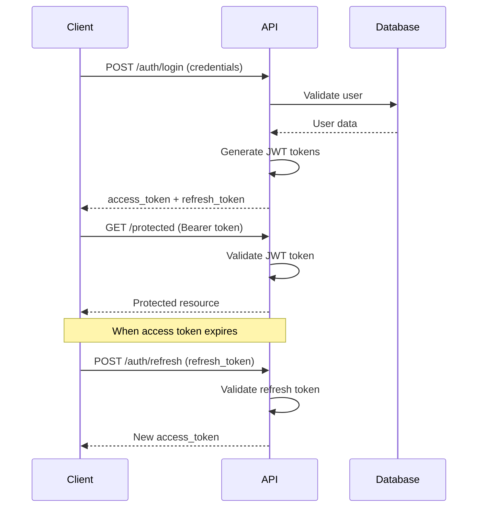

# API Reference

Complete reference for the ReViewPoint FastAPI backend API. All endpoints are secured and require appropriate authentication unless otherwise noted.

## Base URL

```
Development: http://localhost:8000
Production: https://your-domain.com
```

## Authentication

### Overview

ReViewPoint uses **JWT (JSON Web Tokens)** for authentication with both access and refresh tokens.

- **Access tokens**: Short-lived (15 minutes), used for API requests
- **Refresh tokens**: Long-lived (7 days), used to obtain new access tokens

### Authentication Flow



### Required Headers

For all protected endpoints, include the access token in the Authorization header:

```http
Authorization: Bearer <access_token>
Content-Type: application/json
```

## Endpoint Categories

### Authentication Endpoints

#### POST `/api/v1/auth/register`

Register a new user account.

**Request Body:**

```json
{
  "username": "string",        // 3-50 characters, alphanumeric + underscore
  "email": "string",           // Valid email format
  "password": "string"         // Minimum 8 characters
}
```

**Response (201 Created):**

```json
{
  "id": "uuid",
  "username": "string",
  "email": "string",
  "role": "user",
  "created_at": "2024-01-01T00:00:00Z",
  "updated_at": "2024-01-01T00:00:00Z"
}
```

**Error Responses:**

```json
// 400 Bad Request - Validation error
{
  "detail": "Username already exists"
}

// 422 Unprocessable Entity - Invalid data
{
  "detail": [
    {
      "loc": ["body", "email"],
      "msg": "field required",
      "type": "value_error.missing"
    }
  ]
}
```

**Example:**

```bash
curl -X POST "http://localhost:8000/api/v1/auth/register" \
  -H "Content-Type: application/json" \
  -d '{
    "username": "newuser",
    "email": "newuser@example.com",
    "password": "securepassword123"
  }'
```

#### POST `/api/v1/auth/login`

Authenticate user and receive JWT tokens.

**Request Body:**

```json
{
  "username": "string",        // Username or email
  "password": "string"
}
```

**Response (200 OK):**

```json
{
  "access_token": "string",
  "refresh_token": "string",
  "token_type": "bearer",
  "expires_in": 900,           // seconds (15 minutes)
  "user": {
    "id": "uuid",
    "username": "string",
    "email": "string",
    "role": "user"
  }
}
```

**Error Responses:**

```json
// 401 Unauthorized - Invalid credentials
{
  "detail": "Invalid username or password"
}

// 429 Too Many Requests - Rate limiting
{
  "detail": "Too many login attempts. Please try again later."
}
```

**Example:**

```bash
curl -X POST "http://localhost:8000/api/v1/auth/login" \
  -H "Content-Type: application/json" \
  -d '{
    "username": "newuser",
    "password": "securepassword123"
  }'
```

#### POST `/api/v1/auth/refresh`

Refresh access token using refresh token.

**Request Body:**

```json
{
  "refresh_token": "string"
}
```

**Response (200 OK):**

```json
{
  "access_token": "string",
  "token_type": "bearer",
  "expires_in": 900
}
```

**Error Responses:**

```json
// 401 Unauthorized - Invalid refresh token
{
  "detail": "Invalid refresh token"
}
```

#### POST `/api/v1/auth/logout`

Logout user and invalidate tokens.

**Headers:** `Authorization: Bearer <access_token>`

**Response (204 No Content)**

**Error Responses:**

```json
// 401 Unauthorized - Invalid or expired token
{
  "detail": "Could not validate credentials"
}
```

### User Management Endpoints

#### GET `/api/v1/users/me`

Get current user profile.

**Headers:** `Authorization: Bearer <access_token>`

**Response (200 OK):**

```json
{
  "id": "uuid",
  "username": "string",
  "email": "string",
  "role": "user",
  "created_at": "2024-01-01T00:00:00Z",
  "updated_at": "2024-01-01T00:00:00Z",
  "stats": {
    "total_uploads": 42,
    "total_storage_used": 1048576    // bytes
  }
}
```

#### PUT `/api/v1/users/me`

Update current user profile.

**Headers:** `Authorization: Bearer <access_token>`

**Request Body:**

```json
{
  "email": "string",           // Optional
  "username": "string"         // Optional
}
```

**Response (200 OK):**

```json
{
  "id": "uuid",
  "username": "string",
  "email": "string",
  "role": "user",
  "created_at": "2024-01-01T00:00:00Z",
  "updated_at": "2024-01-01T00:00:00Z"
}
```

#### POST `/api/v1/users/change-password`

Change user password.

**Headers:** `Authorization: Bearer <access_token>`

**Request Body:**

```json
{
  "current_password": "string",
  "new_password": "string"
}
```

**Response (200 OK):**

```json
{
  "message": "Password changed successfully"
}
```

**Error Responses:**

```json
// 400 Bad Request - Current password incorrect
{
  "detail": "Current password is incorrect"
}

// 422 Unprocessable Entity - New password validation failed
{
  "detail": "Password must be at least 8 characters long"
}
```

### File Upload Endpoints

#### POST `/api/v1/uploads/`

Upload a new file.

**Headers:**

- `Authorization: Bearer <access_token>`
- `Content-Type: multipart/form-data`

**Request Body (Form Data):**

```
file: [binary file data]     // Required, max 10MB
description: "string"        // Optional file description
```

**Response (201 Created):**

```json
{
  "id": "uuid",
  "filename": "document.pdf",
  "original_filename": "my-document.pdf",
  "content_type": "application/pdf",
  "file_size": 1048576,
  "file_hash": "sha256:abc123...",
  "description": "Important document",
  "upload_date": "2024-01-01T00:00:00Z",
  "user_id": "uuid"
}
```

**Error Responses:**

```json
// 413 Payload Too Large - File too big
{
  "detail": "File size exceeds maximum limit (10MB)"
}

// 415 Unsupported Media Type - Invalid file type
{
  "detail": "File type not allowed"
}

// 507 Insufficient Storage - Storage quota exceeded
{
  "detail": "Storage quota exceeded"
}
```

**Example:**

```bash
curl -X POST "http://localhost:8000/api/v1/uploads/" \
  -H "Authorization: Bearer <access_token>" \
  -F "file=@document.pdf" \
  -F "description=Important document"
```

#### GET `/api/v1/uploads/`

List user's uploaded files with pagination and filtering.

**Headers:** `Authorization: Bearer <access_token>`

**Query Parameters:**

```
page: int = 1                // Page number (1-based)
size: int = 20               // Items per page (max 100)
search: str = None           // Search in filename/description
content_type: str = None     // Filter by MIME type
sort_by: str = "upload_date" // Sort field: upload_date, filename, file_size
sort_order: str = "desc"     // Sort order: asc, desc
```

**Response (200 OK):**

```json
{
  "items": [
    {
      "id": "uuid",
      "filename": "document.pdf",
      "original_filename": "my-document.pdf",
      "content_type": "application/pdf",
      "file_size": 1048576,
      "description": "Important document",
      "upload_date": "2024-01-01T00:00:00Z"
    }
  ],
  "total": 42,
  "page": 1,
  "size": 20,
  "pages": 3
}
```

**Example:**

```bash
curl "http://localhost:8000/api/v1/uploads/?page=1&size=10&search=document" \
  -H "Authorization: Bearer <access_token>"
```

#### GET `/api/v1/uploads/{file_id}`

Get file metadata by ID.

**Headers:** `Authorization: Bearer <access_token>`

**Response (200 OK):**

```json
{
  "id": "uuid",
  "filename": "document.pdf",
  "original_filename": "my-document.pdf",
  "content_type": "application/pdf",
  "file_size": 1048576,
  "file_hash": "sha256:abc123...",
  "description": "Important document",
  "upload_date": "2024-01-01T00:00:00Z",
  "user_id": "uuid"
}
```

**Error Responses:**

```json
// 404 Not Found - File doesn't exist or no access
{
  "detail": "File not found"
}
```

#### GET `/api/v1/uploads/{file_id}/download`

Download file content.

**Headers:** `Authorization: Bearer <access_token>`

**Response (200 OK):**

- Content-Type: [original file MIME type]
- Content-Disposition: attachment; filename="original_filename"
- Body: [binary file data]

**Example:**

```bash
curl "http://localhost:8000/api/v1/uploads/123e4567-e89b-12d3-a456-426614174000/download" \
  -H "Authorization: Bearer <access_token>" \
  -o downloaded_file.pdf
```

#### PUT `/api/v1/uploads/{file_id}`

Update file metadata.

**Headers:** `Authorization: Bearer <access_token>`

**Request Body:**

```json
{
  "description": "string",     // Optional
  "filename": "string"         // Optional (changes display name only)
}
```

**Response (200 OK):**

```json
{
  "id": "uuid",
  "filename": "new-name.pdf",
  "original_filename": "my-document.pdf",
  "content_type": "application/pdf",
  "file_size": 1048576,
  "description": "Updated description",
  "upload_date": "2024-01-01T00:00:00Z",
  "updated_at": "2024-01-01T10:00:00Z"
}
```

#### DELETE `/api/v1/uploads/{file_id}`

Delete a file.

**Headers:** `Authorization: Bearer <access_token>`

**Response (204 No Content)**

**Error Responses:**

```json
// 404 Not Found - File doesn't exist or no access
{
  "detail": "File not found"
}
```

### Admin Endpoints

#### GET `/api/v1/admin/users`

List all users (admin only).

**Headers:** `Authorization: Bearer <access_token>`
**Required Role:** `admin`

**Query Parameters:**

```
page: int = 1
size: int = 20
search: str = None           // Search in username/email
role: str = None            // Filter by role
active: bool = None         // Filter by active status
```

**Response (200 OK):**

```json
{
  "items": [
    {
      "id": "uuid",
      "username": "string",
      "email": "string",
      "role": "user",
      "is_active": true,
      "created_at": "2024-01-01T00:00:00Z",
      "last_login": "2024-01-01T10:00:00Z",
      "stats": {
        "total_uploads": 10,
        "total_storage_used": 10485760
      }
    }
  ],
  "total": 100,
  "page": 1,
  "size": 20,
  "pages": 5
}
```

#### PUT `/api/v1/admin/users/{user_id}`

Update user (admin only).

**Headers:** `Authorization: Bearer <access_token>`
**Required Role:** `admin`

**Request Body:**

```json
{
  "role": "admin",             // Optional: user, admin
  "is_active": false          // Optional: activate/deactivate
}
```

**Response (200 OK):**

```json
{
  "id": "uuid",
  "username": "string",
  "email": "string",
  "role": "admin",
  "is_active": false,
  "created_at": "2024-01-01T00:00:00Z",
  "updated_at": "2024-01-01T10:00:00Z"
}
```

#### GET `/api/v1/admin/stats`

Get system statistics (admin only).

**Headers:** `Authorization: Bearer <access_token>`
**Required Role:** `admin`

**Response (200 OK):**

```json
{
  "users": {
    "total": 1000,
    "active": 950,
    "new_this_month": 50
  },
  "files": {
    "total": 5000,
    "total_size": 10737418240,
    "uploads_this_month": 200
  },
  "storage": {
    "used": 10737418240,
    "quota": 107374182400,
    "usage_percentage": 10.0
  }
}
```

## Error Handling

### Standard Error Format

All API errors follow this consistent format:

```json
{
  "detail": "string",          // Human-readable error message
  "error_code": "string",      // Machine-readable error code (optional)
  "field_errors": {            // Field-specific errors (validation)
    "field_name": ["error message"]
  }
}
```

### HTTP Status Codes

| Code | Meaning | Usage |
|------|---------|-------|
| 200 | OK | Successful GET, PUT requests |
| 201 | Created | Successful POST requests |
| 204 | No Content | Successful DELETE requests |
| 400 | Bad Request | Invalid request data |
| 401 | Unauthorized | Missing or invalid authentication |
| 403 | Forbidden | Valid auth, insufficient permissions |
| 404 | Not Found | Resource doesn't exist |
| 409 | Conflict | Resource already exists |
| 413 | Payload Too Large | File too big |
| 415 | Unsupported Media Type | Invalid file type |
| 422 | Unprocessable Entity | Validation errors |
| 429 | Too Many Requests | Rate limiting |
| 500 | Internal Server Error | Server-side errors |
| 507 | Insufficient Storage | Storage quota exceeded |

## Rate Limiting

### Default Limits

- **Authentication endpoints**: 5 requests per minute per IP
- **File uploads**: 10 requests per minute per user
- **General API**: 100 requests per minute per user
- **Admin endpoints**: 200 requests per minute per admin

### Rate Limit Headers

All responses include rate limiting headers:

```http
X-RateLimit-Limit: 100
X-RateLimit-Remaining: 95
X-RateLimit-Reset: 1640995200
X-RateLimit-Retry-After: 60
```

## Pagination

### Standard Pagination Format

All list endpoints support pagination with consistent parameters:

**Query Parameters:**

- `page`: Page number (1-based, default: 1)
- `size`: Items per page (default: 20, max: 100)

**Response Format:**

```json
{
  "items": [],                 // Array of results
  "total": 100,               // Total number of items
  "page": 1,                  // Current page
  "size": 20,                 // Items per page
  "pages": 5                  // Total number of pages
}
```

### SDKs and Client Libraries

### JavaScript/TypeScript

```bash
npm install @reviewpoint/api-client
```

```typescript
import { ReviewPointAPI } from '@reviewpoint/api-client';

const api = new ReviewPointAPI({
  baseURL: 'http://localhost:8000',
  apiKey: 'your-api-key'
});

// Upload file
const file = new File(['content'], 'test.txt', { type: 'text/plain' });
const result = await api.uploads.create(file, { description: 'Test file' });
```

### Python

```bash
pip install reviewpoint-api
```

```python
from reviewpoint_api import ReviewPointClient

client = ReviewPointClient(
    base_url='http://localhost:8000',
    api_key='your-api-key'
)

# Upload file
with open('document.pdf', 'rb') as f:
    result = client.uploads.create(
        file=f,
        description='Important document'
    )
```

## Testing the API

### Using curl

```bash
# Set variables
API_BASE="http://localhost:8000/api/v1"
TOKEN="your-access-token"

# Login and get token
curl -X POST "$API_BASE/auth/login" \
  -H "Content-Type: application/json" \
  -d '{"username": "testuser", "password": "testpass"}' \
  | jq -r '.access_token'

# Get user profile
curl "$API_BASE/users/me" \
  -H "Authorization: Bearer $TOKEN"

# Upload file
curl -X POST "$API_BASE/uploads/" \
  -H "Authorization: Bearer $TOKEN" \
  -F "file=@document.pdf" \
  -F "description=Test upload"
```

### Using HTTPie

```bash
# Install HTTPie
pip install httpie

# Login
http POST localhost:8000/api/v1/auth/login username=testuser password=testpass

# Use token for requests
http GET localhost:8000/api/v1/users/me Authorization:"Bearer $TOKEN"

# Upload file
http --form POST localhost:8000/api/v1/uploads/ \
  Authorization:"Bearer $TOKEN" \
  file@document.pdf \
  description="Test upload"
```

---

## Next Steps

- **Authentication**: Set up your authentication flow
- **File Uploads**: Implement file upload functionality
- **Error Handling**: Add proper error handling to your client
- **Rate Limiting**: Implement rate limiting awareness

**This API reference provides everything you need to integrate with the ReViewPoint backend. All endpoints are thoroughly tested and documented with comprehensive examples.**
