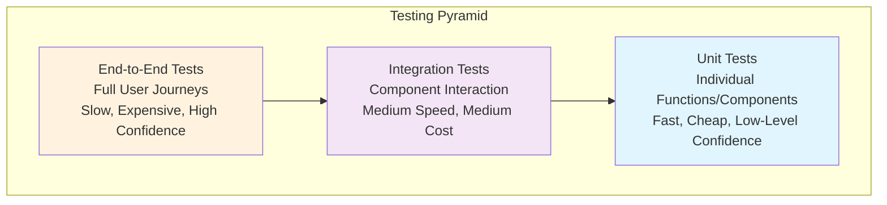

# Testing Guide

ReViewPoint maintains comprehensive testing across all components with **135+ backend tests** and expanding frontend test coverage. This guide covers all testing strategies, tools, and best practices used in the project.

## Testing Philosophy

### Core Principles

1. **Test-Driven Development**: Write tests before implementation when possible
2. **Comprehensive Coverage**: Aim for high test coverage without sacrificing quality
3. **Fast Feedback**: Prioritize fast test execution for development workflows
4. **Realistic Testing**: Use production-like environments where necessary
5. **Maintainable Tests**: Write clear, maintainable tests that serve as documentation

### Testing Pyramid



## Backend Testing

### Test Infrastructure

The backend testing system supports **two testing modes** optimized for different scenarios:

#### Fast Testing Mode (SQLite, 30-60 seconds)

```bash
cd backend

# Default: Run ALL tests with fast database
hatch run fast:test

# Quick feedback: Skip slow tests only
hatch run fast:fast-only

# Watch mode for continuous testing
hatch run fast:watch

# With coverage report
hatch run fast:coverage
```

**Advantages:**

- ✅ In-memory SQLite database (no Docker required)
- ✅ Complete test coverage (135+ tests)
- ✅ Fast execution (30-60 seconds)
- ✅ Perfect for TDD and development

#### Full Testing Mode (PostgreSQL, 2-5 minutes)

```bash
cd backend

# Complete production-like testing
hatch run pytest

# With coverage
hatch run pytest --cov=src --cov-report=html

# Verbose output
hatch run pytest -v

# Specific test files
hatch run pytest tests/test_auth.py
```

**Advantages:**

- ✅ Production PostgreSQL database
- ✅ Real database constraints and behavior
- ✅ Complete integration testing
- ✅ CI/CD validation

### Test Categories

#### Unit Tests

Test individual functions and classes in isolation:

```python
# tests/test_utils.py
import pytest
from src.utils.security import hash_password, verify_password

class TestPasswordUtils:
    def test_hash_password_creates_different_hashes(self):
        """Test that the same password creates different hashes."""
        password = "test_password_123"
        hash1 = hash_password(password)
        hash2 = hash_password(password)

        assert hash1 != hash2
        assert len(hash1) > 50  # bcrypt hashes are long
        assert hash1.startswith("$2b$")  # bcrypt prefix

    def test_verify_password_correct(self):
        """Test password verification with correct password."""
        password = "test_password_123"
        password_hash = hash_password(password)

        assert verify_password(password, password_hash) is True

    def test_verify_password_incorrect(self):
        """Test password verification with incorrect password."""
        password = "test_password_123"
        wrong_password = "wrong_password"
        password_hash = hash_password(password)

        assert verify_password(wrong_password, password_hash) is False
```

#### Model Tests

Test SQLAlchemy models and database operations:

```python
# tests/test_models.py
import pytest
from sqlalchemy.orm import Session
from src.models.user import User
from src.models.file import File

class TestUserModel:
    def test_create_user(self, db: Session):
        """Test creating a new user."""
        user = User(
            username="testuser",
            email="test@example.com",
            password_hash="hashed_password"
        )
        db.add(user)
        db.commit()
        db.refresh(user)

        assert user.id is not None
        assert user.username == "testuser"
        assert user.email == "test@example.com"
        assert user.created_at is not None

    def test_user_relationships(self, db: Session):
        """Test user-file relationships."""
        user = User(
            username="testuser",
            email="test@example.com",
            password_hash="hashed_password"
        )
        db.add(user)
        db.commit()

        file = File(
            user_id=user.id,
            filename="test.txt",
            original_filename="test.txt",
            content_type="text/plain",
            file_size=100,
            file_path="/uploads/test.txt",
            file_hash="abc123"
        )
        db.add(file)
        db.commit()

        # Test relationship loading
        db.refresh(user)
        assert len(user.files) == 1
        assert user.files[0].filename == "test.txt"
```

#### API Tests

Test FastAPI endpoints with realistic scenarios:

```python
# tests/test_auth_api.py
import pytest
from fastapi.testclient import TestClient
from src.main import app

client = TestClient(app)

class TestAuthAPI:
    def test_register_user_success(self, db):
        """Test successful user registration."""
        user_data = {
            "username": "newuser",
            "email": "newuser@example.com",
            "password": "securepassword123"
        }

        response = client.post("/api/v1/auth/register", json=user_data)

        assert response.status_code == 201
        data = response.json()
        assert data["username"] == "newuser"
        assert data["email"] == "newuser@example.com"
        assert "password" not in data  # Password should not be returned

    def test_register_duplicate_username(self, db, test_user):
        """Test registration with duplicate username."""
        user_data = {
            "username": test_user.username,  # Duplicate username
            "email": "different@example.com",
            "password": "securepassword123"
        }

        response = client.post("/api/v1/auth/register", json=user_data)

        assert response.status_code == 400
        assert "username" in response.json()["detail"].lower()

    def test_login_success(self, db, test_user):
        """Test successful login."""
        login_data = {
            "username": test_user.username,
            "password": "testpassword"  # From test fixture
        }

        response = client.post("/api/v1/auth/login", json=login_data)

        assert response.status_code == 200
        data = response.json()
        assert "access_token" in data
        assert "refresh_token" in data
        assert data["token_type"] == "bearer"

    def test_protected_route_without_token(self):
        """Test accessing protected route without authentication."""
        response = client.get("/api/v1/users/me")

        assert response.status_code == 401

    def test_protected_route_with_token(self, auth_headers):
        """Test accessing protected route with valid token."""
        response = client.get("/api/v1/users/me", headers=auth_headers)

        assert response.status_code == 200
        data = response.json()
        assert "id" in data
        assert "username" in data
        assert "email" in data
```

#### Integration Tests

Test complete workflows across multiple components:

```python
# tests/test_file_upload_integration.py
import pytest
from fastapi.testclient import TestClient
from io import BytesIO
from src.main import app

client = TestClient(app)

class TestFileUploadIntegration:
    def test_complete_file_upload_workflow(self, auth_headers, tmp_path):
        """Test complete file upload workflow."""
        # Create test file
        test_content = b"This is test file content"
        test_file = BytesIO(test_content)

        # Upload file
        response = client.post(
            "/api/v1/uploads/",
            headers=auth_headers,
            files={"file": ("test.txt", test_file, "text/plain")}
        )

        assert response.status_code == 201
        upload_data = response.json()
        file_id = upload_data["id"]

        # Verify file metadata
        assert upload_data["filename"] == "test.txt"
        assert upload_data["content_type"] == "text/plain"
        assert upload_data["file_size"] == len(test_content)

        # Get file metadata
        response = client.get(f"/api/v1/uploads/{file_id}", headers=auth_headers)
        assert response.status_code == 200

        # Download file
        response = client.get(f"/api/v1/uploads/{file_id}/download", headers=auth_headers)
        assert response.status_code == 200
        assert response.content == test_content

        # Delete file
        response = client.delete(f"/api/v1/uploads/{file_id}", headers=auth_headers)
        assert response.status_code == 204

        # Verify file is deleted
        response = client.get(f"/api/v1/uploads/{file_id}", headers=auth_headers)
        assert response.status_code == 404
```

### Test Fixtures

Shared test setup and data creation:

```python
# tests/conftest.py
import pytest
import asyncio
from sqlalchemy import create_engine
from sqlalchemy.orm import sessionmaker
from src.core.database import Base, get_db
from src.core.auth import create_access_token
from src.models.user import User
from src.utils.security import hash_password

# Database setup for testing
SQLITE_DATABASE_URL = "sqlite:///./test.db"

engine = create_engine(SQLITE_DATABASE_URL, connect_args={"check_same_thread": False})
TestingSessionLocal = sessionmaker(autocommit=False, autoflush=False, bind=engine)

@pytest.fixture(scope="session")
def db_engine():
    """Create test database engine."""
    Base.metadata.create_all(bind=engine)
    yield engine
    Base.metadata.drop_all(bind=engine)

@pytest.fixture
def db(db_engine):
    """Create test database session."""
    connection = db_engine.connect()
    transaction = connection.begin()
    session = TestingSessionLocal(bind=connection)

    yield session

    session.close()
    transaction.rollback()
    connection.close()

@pytest.fixture
def test_user(db):
    """Create a test user."""
    user = User(
        username="testuser",
        email="test@example.com",
        password_hash=hash_password("testpassword")
    )
    db.add(user)
    db.commit()
    db.refresh(user)
    return user

@pytest.fixture
def auth_headers(test_user):
    """Create authentication headers for test requests."""
    token = create_access_token(data={"sub": str(test_user.id)})
    return {"Authorization": f"Bearer {token}"}

@pytest.fixture
def admin_user(db):
    """Create a test admin user."""
    user = User(
        username="adminuser",
        email="admin@example.com",
        password_hash=hash_password("adminpassword"),
        role=UserRole.ADMIN
    )
    db.add(user)
    db.commit()
    db.refresh(user)
    return user
```

## Frontend Testing

### Testing Framework Setup

The frontend uses **Vitest** for unit testing and **Playwright** for E2E testing:

#### Unit Testing with Vitest

```bash
cd frontend

# Run all unit tests
pnpm run test

# Watch mode for development
pnpm run test:watch

# Coverage report
pnpm run test:coverage

# UI mode (interactive testing)
pnpm run test:ui
```

#### E2E Testing with Playwright

```bash
cd frontend

# Run E2E tests
pnpm run test:e2e

# Run E2E tests in UI mode
pnpm run test:e2e:ui

# Run specific test file
pnpm run test:e2e tests/auth.spec.ts
```

### Component Testing

Test React components in isolation:

```typescript
// tests/components/Button.test.tsx
import { render, screen, fireEvent } from '@testing-library/react'
import { describe, it, expect, vi } from 'vitest'
import { Button } from '@/components/ui/Button'

describe('Button Component', () => {
  it('renders with correct text', () => {
    render(<Button>Click me</Button>)
    expect(screen.getByText('Click me')).toBeInTheDocument()
  })

  it('calls onClick handler when clicked', () => {
    const handleClick = vi.fn()
    render(<Button onClick={handleClick}>Click me</Button>)

    fireEvent.click(screen.getByText('Click me'))
    expect(handleClick).toHaveBeenCalledTimes(1)
  })

  it('shows loading state correctly', () => {
    render(<Button loading>Loading</Button>)

    const button = screen.getByRole('button')
    expect(button).toHaveClass('opacity-50')
    expect(button).toBeDisabled()
    expect(screen.getByText('Loading')).toBeInTheDocument()
  })

  it('applies variant classes correctly', () => {
    const { rerender } = render(<Button variant="primary">Primary</Button>)
    expect(screen.getByRole('button')).toHaveClass('bg-primary')

    rerender(<Button variant="secondary">Secondary</Button>)
    expect(screen.getByRole('button')).toHaveClass('bg-secondary')
  })

  it('forwards ref correctly', () => {
    const ref = vi.fn()
    render(<Button ref={ref}>Button</Button>)
    expect(ref).toHaveBeenCalled()
  })
})
```

### Hook Testing

Test custom React hooks:

```typescript
// tests/hooks/useAuth.test.ts
import { renderHook, act } from "@testing-library/react";
import { describe, it, expect, vi, beforeEach } from "vitest";
import { useAuth } from "@/hooks/useAuth";
import { authAPI } from "@/lib/api/auth";

// Mock API calls
vi.mock("@/lib/api/auth");

describe("useAuth Hook", () => {
  beforeEach(() => {
    vi.clearAllMocks();
    localStorage.clear();
  });

  it("initializes with correct default state", () => {
    const { result } = renderHook(() => useAuth());

    expect(result.current.user).toBeNull();
    expect(result.current.isAuthenticated).toBe(false);
    expect(result.current.isLoading).toBe(false);
  });

  it("handles login successfully", async () => {
    const mockUser = {
      id: "1",
      username: "testuser",
      email: "test@example.com",
    };
    const mockResponse = {
      data: {
        access_token: "token123",
        user: mockUser,
      },
    };

    vi.mocked(authAPI.login).mockResolvedValueOnce(mockResponse);

    const { result } = renderHook(() => useAuth());

    await act(async () => {
      await result.current.login({
        username: "testuser",
        password: "password",
      });
    });

    expect(result.current.user).toEqual(mockUser);
    expect(result.current.isAuthenticated).toBe(true);
    expect(localStorage.getItem("access_token")).toBe("token123");
  });

  it("handles login failure", async () => {
    const error = new Error("Invalid credentials");
    vi.mocked(authAPI.login).mockRejectedValueOnce(error);

    const { result } = renderHook(() => useAuth());

    await act(async () => {
      try {
        await result.current.login({ username: "wrong", password: "wrong" });
      } catch (e) {
        expect(e).toBe(error);
      }
    });

    expect(result.current.user).toBeNull();
    expect(result.current.isAuthenticated).toBe(false);
  });

  it("handles logout correctly", () => {
    // Set initial authenticated state
    localStorage.setItem("access_token", "token123");

    const { result } = renderHook(() => useAuth());

    act(() => {
      result.current.logout();
    });

    expect(result.current.user).toBeNull();
    expect(result.current.isAuthenticated).toBe(false);
    expect(localStorage.getItem("access_token")).toBeNull();
  });
});
```

### E2E Testing

Test complete user journeys:

```typescript
// e2e/auth.spec.ts
import { test, expect } from "@playwright/test";

test.describe("Authentication Flow", () => {
  test.beforeEach(async ({ page }) => {
    // Start from clean state
    await page.goto("/");
  });

  test("complete registration and login flow", async ({ page }) => {
    // Navigate to registration
    await page.click('[data-testid="register-link"]');
    await expect(page).toHaveURL("/register");

    // Fill registration form
    await page.fill('[data-testid="username-input"]', "newuser");
    await page.fill('[data-testid="email-input"]', "newuser@example.com");
    await page.fill('[data-testid="password-input"]', "securepassword123");
    await page.fill(
      '[data-testid="confirm-password-input"]',
      "securepassword123",
    );

    // Submit registration
    await page.click('[data-testid="register-button"]');

    // Should redirect to login
    await expect(page).toHaveURL("/login");
    await expect(page.locator('[data-testid="success-message"]')).toBeVisible();

    // Now login with new account
    await page.fill('[data-testid="username-input"]', "newuser");
    await page.fill('[data-testid="password-input"]', "securepassword123");
    await page.click('[data-testid="login-button"]');

    // Should be redirected to dashboard
    await expect(page).toHaveURL("/dashboard");
    await expect(page.locator('[data-testid="user-menu"]')).toBeVisible();
    await expect(page.locator('[data-testid="welcome-message"]')).toContainText(
      "newuser",
    );
  });

  test("handles login errors gracefully", async ({ page }) => {
    await page.goto("/login");

    // Try with invalid credentials
    await page.fill('[data-testid="username-input"]', "wronguser");
    await page.fill('[data-testid="password-input"]', "wrongpassword");
    await page.click('[data-testid="login-button"]');

    // Should show error message
    await expect(page.locator('[data-testid="error-message"]')).toBeVisible();
    await expect(page.locator('[data-testid="error-message"]')).toContainText(
      "Invalid",
    );

    // Should still be on login page
    await expect(page).toHaveURL("/login");
  });

  test("maintains authentication across page reloads", async ({ page }) => {
    // Login first
    await page.goto("/login");
    await page.fill('[data-testid="username-input"]', "testuser");
    await page.fill('[data-testid="password-input"]', "testpassword");
    await page.click('[data-testid="login-button"]');

    await expect(page).toHaveURL("/dashboard");

    // Reload page
    await page.reload();

    // Should still be authenticated
    await expect(page).toHaveURL("/dashboard");
    await expect(page.locator('[data-testid="user-menu"]')).toBeVisible();
  });

  test("redirects to login when accessing protected route", async ({
    page,
  }) => {
    // Try to access protected route without authentication
    await page.goto("/dashboard");

    // Should redirect to login
    await expect(page).toHaveURL("/login");
    await expect(
      page.locator('[data-testid="redirect-message"]'),
    ).toBeVisible();
  });
});
```

### File Upload Testing

Test file upload functionality:

```typescript
// e2e/uploads.spec.ts
import { test, expect } from "@playwright/test";
import path from "path";

test.describe("File Upload", () => {
  test.beforeEach(async ({ page }) => {
    // Login before each test
    await page.goto("/login");
    await page.fill('[data-testid="username-input"]', "testuser");
    await page.fill('[data-testid="password-input"]', "testpassword");
    await page.click('[data-testid="login-button"]');
    await expect(page).toHaveURL("/dashboard");
  });

  test("uploads file successfully", async ({ page }) => {
    await page.goto("/uploads");

    // Create test file
    const testFilePath = path.join(__dirname, "fixtures", "test.txt");

    // Upload file via drag and drop area
    const fileChooserPromise = page.waitForEvent("filechooser");
    await page.click('[data-testid="upload-area"]');
    const fileChooser = await fileChooserPromise;
    await fileChooser.setFiles(testFilePath);

    // Wait for upload to complete
    await expect(page.locator('[data-testid="upload-success"]')).toBeVisible();
    await expect(page.locator('[data-testid="file-list"]')).toContainText(
      "test.txt",
    );

    // Verify file appears in list
    const fileItem = page.locator('[data-testid="file-item"]').first();
    await expect(fileItem).toContainText("test.txt");
    await expect(fileItem).toContainText("text/plain");
  });

  test("handles large file upload", async ({ page }) => {
    await page.goto("/uploads");

    // Try to upload file larger than limit
    const largeFilePath = path.join(__dirname, "fixtures", "large-file.zip");

    const fileChooserPromise = page.waitForEvent("filechooser");
    await page.click('[data-testid="upload-area"]');
    const fileChooser = await fileChooserPromise;
    await fileChooser.setFiles(largeFilePath);

    // Should show error message
    await expect(page.locator('[data-testid="upload-error"]')).toBeVisible();
    await expect(page.locator('[data-testid="upload-error"]')).toContainText(
      "too large",
    );
  });

  test("downloads file correctly", async ({ page }) => {
    await page.goto("/uploads");

    // Assume file exists from previous test or fixture
    const fileItem = page.locator('[data-testid="file-item"]').first();

    // Start download
    const downloadPromise = page.waitForEvent("download");
    await fileItem.locator('[data-testid="download-button"]').click();
    const download = await downloadPromise;

    // Verify download
    expect(download.suggestedFilename()).toBe("test.txt");

    // Save and verify content
    const downloadPath = path.join(__dirname, "downloads", "test.txt");
    await download.saveAs(downloadPath);

    // Could verify file content here if needed
  });
});
```

## Test Configuration

### Vitest Configuration

```typescript
// vitest.config.ts
import { defineConfig } from "vitest/config";
import react from "@vitejs/plugin-react";
import path from "path";

export default defineConfig({
  plugins: [react()],
  test: {
    globals: true,
    environment: "jsdom",
    setupFiles: ["./tests/setup.ts"],
    coverage: {
      provider: "v8",
      reporter: ["text", "json", "html"],
      exclude: [
        "node_modules/",
        "tests/",
        "**/*.d.ts",
        "**/*.config.*",
        "dist/",
      ],
    },
  },
  resolve: {
    alias: {
      "@": path.resolve(__dirname, "./src"),
    },
  },
});
```

### Playwright Configuration

```typescript
// playwright.config.ts
import { defineConfig, devices } from "@playwright/test";

export default defineConfig({
  testDir: "./e2e",
  fullyParallel: true,
  forbidOnly: !!process.env.CI,
  retries: process.env.CI ? 2 : 0,
  workers: process.env.CI ? 1 : undefined,
  reporter: "html",
  use: {
    baseURL: "http://localhost:3000",
    trace: "on-first-retry",
    screenshot: "only-on-failure",
  },
  projects: [
    {
      name: "chromium",
      use: { ...devices["Desktop Chrome"] },
    },
    {
      name: "firefox",
      use: { ...devices["Desktop Firefox"] },
    },
    {
      name: "webkit",
      use: { ...devices["Desktop Safari"] },
    },
    {
      name: "Mobile Chrome",
      use: { ...devices["Pixel 5"] },
    },
  ],
  webServer: {
    command: "pnpm run dev",
    url: "http://localhost:3000",
    reuseExistingServer: !process.env.CI,
  },
});
```

## Testing Best Practices

### Writing Good Tests

#### 1. Follow AAA Pattern

```typescript
// Arrange - Set up test data and conditions
const user = createTestUser();
const mockAPI = vi.fn().mockResolvedValue({ data: user });

// Act - Execute the function being tested
const result = await getUserProfile(user.id);

// Assert - Verify the expected outcome
expect(result).toEqual(user);
expect(mockAPI).toHaveBeenCalledWith(user.id);
```

#### 2. Use Descriptive Test Names

```typescript
// ❌ Bad: Vague test name
test("login works", () => {});

// ✅ Good: Descriptive test name
test("should redirect to dashboard after successful login with valid credentials", () => {});
```

#### 3. Test Edge Cases

```typescript
describe("UserService.validateEmail", () => {
  it("should accept valid email addresses", () => {
    expect(validateEmail("user@example.com")).toBe(true);
    expect(validateEmail("test.email+tag@example.co.uk")).toBe(true);
  });

  it("should reject invalid email addresses", () => {
    expect(validateEmail("invalid-email")).toBe(false);
    expect(validateEmail("user@")).toBe(false);
    expect(validateEmail("@example.com")).toBe(false);
  });

  it("should handle edge cases", () => {
    expect(validateEmail("")).toBe(false);
    expect(validateEmail(null)).toBe(false);
    expect(validateEmail(undefined)).toBe(false);
  });
});
```

#### 4. Keep Tests Independent

```typescript
// ❌ Bad: Tests depend on each other
let sharedUser: User;

test("creates user", () => {
  sharedUser = createUser("test@example.com");
  expect(sharedUser).toBeDefined();
});

test("updates user", () => {
  // This test depends on the previous test
  sharedUser.email = "updated@example.com";
  expect(updateUser(sharedUser)).toBe(true);
});

// ✅ Good: Independent tests
test("creates user", () => {
  const user = createUser("test@example.com");
  expect(user).toBeDefined();
});

test("updates user", () => {
  const user = createUser("test@example.com");
  user.email = "updated@example.com";
  expect(updateUser(user)).toBe(true);
});
```

### Performance Testing

#### Load Testing with Artillery

```yaml
# artillery-config.yml
config:
  target: "http://localhost:8000"
  phases:
    - duration: 60
      arrivalRate: 10
  payload:
    path: "users.csv"
    fields:
      - "username"
      - "password"

scenarios:
  - name: "Login and fetch profile"
    weight: 100
    flow:
      - post:
          url: "/api/v1/auth/login"
          json:
            username: "{{ username }}"
            password: "{{ password }}"
          capture:
            json: "$.access_token"
            as: "token"
      - get:
          url: "/api/v1/users/me"
          headers:
            Authorization: "Bearer {{ token }}"
```

### Test Data Management

#### Fixtures and Factories

```typescript
// tests/fixtures/users.ts
export const userFixtures = {
  validUser: {
    username: "testuser",
    email: "test@example.com",
    password: "securepassword123",
  },
  adminUser: {
    username: "admin",
    email: "admin@example.com",
    password: "adminpassword123",
    role: "admin",
  },
};

// tests/factories/userFactory.ts
export const createUser = (overrides = {}) => ({
  id: Math.random().toString(36).substr(2, 9),
  username: `user${Math.random().toString(36).substr(2, 5)}`,
  email: `test${Math.random().toString(36).substr(2, 5)}@example.com`,
  role: "user",
  created_at: new Date().toISOString(),
  ...overrides,
});
```

## Continuous Integration

### GitHub Actions Test Workflow

```yaml
# .github/workflows/test.yml
name: Tests

on:
  push:
    branches: [main, develop]
  pull_request:
    branches: [main]

jobs:
  backend-tests:
    runs-on: ubuntu-latest

    services:
      postgres:
        image: postgres:15
        env:
          POSTGRES_PASSWORD: postgres
          POSTGRES_DB: reviewpoint_test
        options: >-
          --health-cmd pg_isready
          --health-interval 10s
          --health-timeout 5s
          --health-retries 5

    steps:
      - uses: actions/checkout@v3

      - name: Set up Python
        uses: actions/setup-python@v4
        with:
          python-version: "3.11"

      - name: Install Hatch
        run: pip install hatch

      - name: Run backend tests
        run: |
          cd backend
          hatch run pytest --cov=src --cov-report=xml

      - name: Upload coverage
        uses: codecov/codecov-action@v3
        with:
          file: ./backend/coverage.xml

  frontend-tests:
    runs-on: ubuntu-latest

    steps:
      - uses: actions/checkout@v3

      - name: Set up Node.js
        uses: actions/setup-node@v3
        with:
          node-version: "18"
          cache: "pnpm"

      - name: Install dependencies
        run: pnpm install

      - name: Run frontend tests
        run: |
          cd frontend
          pnpm run test:coverage
          pnpm run build

      - name: Run E2E tests
        run: |
          cd frontend
          pnpm run test:e2e

  integration-tests:
    runs-on: ubuntu-latest
    needs: [backend-tests, frontend-tests]

    steps:
      - uses: actions/checkout@v3

      - name: Set up full environment
        run: |
          pnpm install
          pnpm run dev:postgres &
          sleep 30  # Wait for services to start

      - name: Run integration tests
        run: pnpm run test:integration
```

## Debugging Tests

### Common Debugging Techniques

#### 1. Using Console Logs in Tests

```typescript
test("debug test data", () => {
  const user = createTestUser();
  console.log("User data:", JSON.stringify(user, null, 2));

  const result = processUser(user);
  console.log("Result:", result);

  expect(result).toBeDefined();
});
```

#### 2. Using VS Code Debugger

```json
// .vscode/launch.json
{
  "version": "0.2.0",
  "configurations": [
    {
      "name": "Debug Vitest Tests",
      "type": "node",
      "request": "launch",
      "program": "${workspaceFolder}/frontend/node_modules/vitest/vitest.mjs",
      "args": ["run", "--reporter=verbose"],
      "cwd": "${workspaceFolder}/frontend",
      "console": "integratedTerminal",
      "internalConsoleOptions": "neverOpen"
    }
  ]
}
```

#### 3. Using Playwright Debug Mode

```bash
# Run Playwright tests in debug mode
cd frontend
pnpm run test:e2e --debug

# Run specific test with debug
pnpm run test:e2e tests/auth.spec.ts --debug
```

---

## Next Steps

- **Implementation**: Apply these testing practices in your development workflow
- **Coverage**: Aim for high test coverage while maintaining test quality
- **Automation**: Integrate testing into your CI/CD pipeline
- **Performance**: Regularly run performance tests to ensure scalability

**This comprehensive testing guide provides the foundation for maintaining high-quality, reliable code in the ReViewPoint project. Regular testing ensures that new features don't break existing functionality and that the application remains stable as it grows.**
