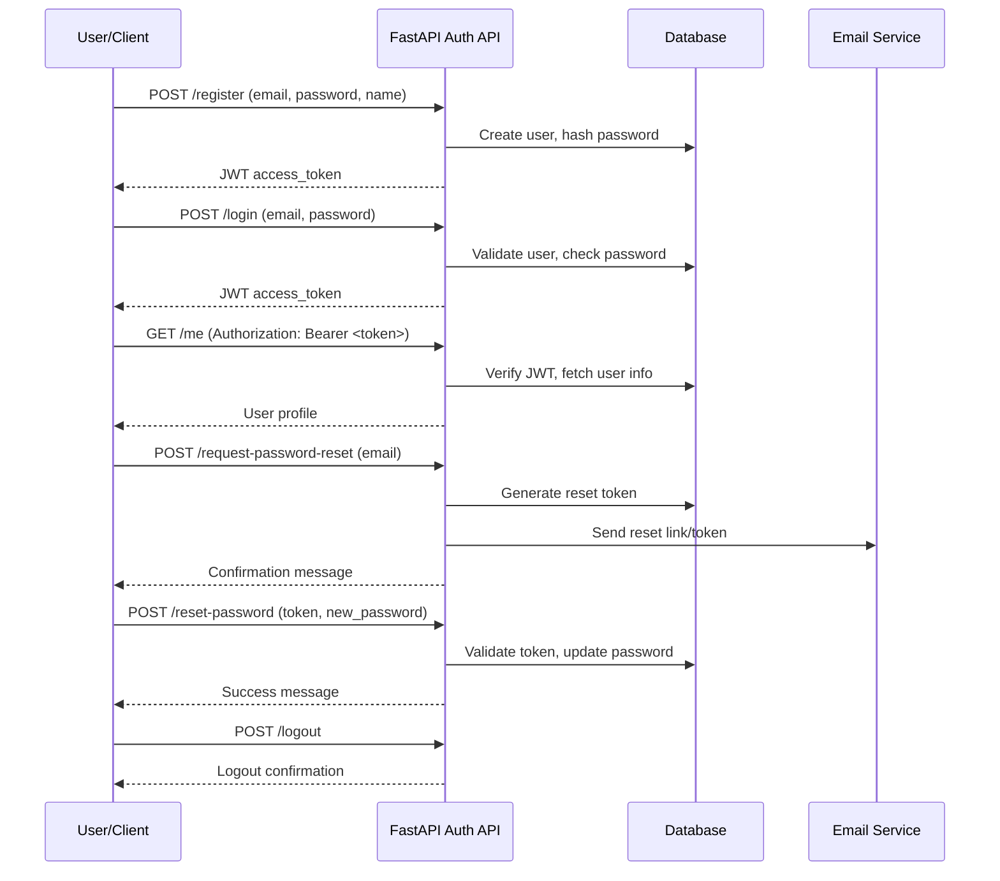

<!-- filepath: c:\Users\00010654\Documents\Git\ReViewPoint\docs\backend\api\v1\auth.py.md -->

# `api/v1/auth.py`

| Item               | Value                                                                        |
| ------------------ | ---------------------------------------------------------------------------- |
| **Layer**          | API                                                                          |
| **Responsibility** | Authentication endpoints: register, login, logout, password reset, user info |
| **Status**         | 🟢 Implemented                                                               |

## 1. Purpose

This module provides all authentication-related endpoints for the ReViewPoint backend API, including registration, login, logout, password reset, and user info retrieval.

## 2. Public API

### POST `/api/v1/auth/register`

- **Description:** Register a new user and return a JWT access token.
- **Request:**

```json
{
  "email": "user@example.com",
  "password": "string (min 8 chars)",
  "name": "Optional Name"
}
```

- **Response:**

```json
{ "access_token": "...", "token_type": "bearer" }
```

### POST `/api/v1/auth/login`

- **Description:** Authenticate user and return a JWT access token.
- **Request:**

```json
{ "email": "user@example.com", "password": "string" }
```

- **Response:**

```json
{ "access_token": "...", "token_type": "bearer" }
```

### POST `/api/v1/auth/logout`

- **Description:** Log out the current user (requires authentication).
- **Response:**

```json
{ "message": "Logged out successfully." }
```

### POST `/api/v1/auth/request-password-reset`

- **Description:** Request a password reset link (token is logged for dev, email in prod).
- **Request:**

```json
{ "email": "user@example.com" }
```

- **Response:**

```json
{ "message": "Password reset link sent." }
```

### POST `/api/v1/auth/reset-password`

- **Description:** Reset password using a valid reset token.
- **Request:**

```json
{ "token": "...", "new_password": "string (min 8 chars)" }
```

- **Response:**

```json
{ "message": "Password has been reset." }
```

### GET `/api/v1/auth/me`

- **Description:** Get the current user's profile (requires authentication).
- **Response:**

```json
{
  "id": 1,
  "email": "user@example.com",
  "name": "User Name",
  ...
}
```

## 3. Behaviour & Edge-Cases

- All endpoints respect the `auth_enabled` config toggle (dev mode bypasses auth).
- All errors return structured JSON with appropriate HTTP status codes.
- Password reset tokens are one-time use and time-limited.
- No sensitive data is ever logged.

## 4. Dependencies

- **Internal:** `services.user`, `core.security`, `core.config`, `models.user`, `schemas.auth`
- **External:** FastAPI, SQLAlchemy, Loguru

## 5. Tests

| Test file                | Scenario                                                               |
| ------------------------ | ---------------------------------------------------------------------- |
| `test_auth_endpoints.py` | Register, login, logout, password reset, /me, error cases, auth toggle |

## 6. Security Considerations

- JWT tokens are signed and time-limited.
- Passwords are never logged or returned.
- All logging uses loguru and omits sensitive data.
- Auth toggle is for development only—never use in production.

## 7. Authentication Flow Diagram



> **Update this page whenever the implementation changes.**
